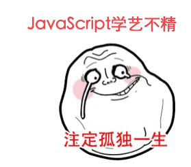

#4-1 Date

在JavaScript中，Date对象用来表示日期和时间。

要获取系统当前时间，用：

	var now = new Date();
	now; // Wed Jun 24 2015 19:49:22 GMT+0800 (CST)
	now.getFullYear(); // 2015, 年份
	now.getMonth(); // 5, 月份，注意月份范围是0~11，5表示六月
	now.getDate(); // 24, 表示24号
	now.getDay(); // 3, 表示星期三
	now.getHours(); // 19, 24小时制
	now.getMinutes(); // 49, 分钟
	now.getSeconds(); // 22, 秒
	now.getMilliseconds(); // 875, 毫秒数
	now.getTime(); // 1435146562875, 以number形式表示的时间戳
注意，当前时间是浏览器从本机操作系统获取的时间，所以不一定准确，因为用户可以把当前时间设定为任何值。

如果要创建一个指定日期和时间的Date对象，可以用：

	var d = new Date(2015, 5, 19, 20, 15, 30, 123);
	d; // Fri Jun 19 2015 20:15:30 GMT+0800 (CST)
你可能观察到了一个非常非常坑爹的地方，就是JavaScript的月份范围用整数表示是0~11，0表示一月，1表示二月……，所以要表示6月，我们传入的是5！这绝对是JavaScript的设计者当时脑抽了一下，但是现在要修复已经不可能了。

第二种创建一个指定日期和时间的方法是解析一个符合ISO 8601格式的字符串：

	var d = Date.parse('2015-06-24T19:49:22.875+08:00');
	d; // 1435146562875
但它返回的不是Date对象，而是一个时间戳。不过有时间戳就可以很容易地把它转换为一个Date：

	var d = new Date(1435146562875);
	d; // Wed Jun 24 2015 19:49:22 GMT+0800 (CST)
##时区

Date对象表示的时间总是按浏览器所在时区显示的，不过我们既可以显示本地时间，也可以显示调整后的UTC时间：

	var d = new Date(1435146562875);
	d.toLocaleString(); // '2015/6/24 下午7:49:22'，本地时间（北京时区+8:00），显示的字符串与操作系统设定的格式有关
	d.toUTCString(); // 'Wed, 24 Jun 2015 11:49:22 GMT'，UTC时间，与本地时间相差8小时
那么在JavaScript中如何进行时区转换呢？实际上，只要我们传递的是一个number类型的时间戳，我们就不用关心时区转换。任何浏览器都可以把一个时间戳正确转换为本地时间。

时间戳是个什么东西？时间戳是一个自增的整数，它表示从1970年1月1日零时整的GMT时区开始的那一刻，到现在的毫秒数。假设浏览器所在电脑的时间是准确的，那么世界上无论哪个时区的电脑，它们此刻产生的时间戳数字都是一样的，所以，时间戳可以精确地表示一个时刻，并且与时区无关。

所以，我们只需要传递时间戳，或者把时间戳从数据库里读出来，再让JavaScript自动转换为当地时间就可以了。

要获取当前时间戳，可以用：

	if (Date.now) {
	    alert(Date.now()); // 老版本IE没有now()方法
	} else {
	    alert(new Date().getTime());
	}

##练习

小明为了和女友庆祝情人节，特意制作了网页，并提前预定了法式餐厅。小明打算用JavaScript给女友一个惊喜留言：

	'use strict';
	
	var today = new Date();
	if (today.getMonth() === 2 && today.getDate() === 14) {
	    alert('亲爱的，我预定了晚餐，晚上6点在餐厅见！');
	}

结果女友并未出现。小明非常郁闷，请你帮忙分析他的JavaScript代码有何问题。

