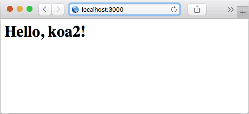

#9-6-1-1 koa入门

##创建koa2工程

首先，我们创建一个目录hello-koa并作为工程目录用VS Code打开。然后，我们创建app.js，输入以下代码：

	// 导入koa，和koa 1.x不同，在koa2中，我们导入的是一个class，因此用大写的Koa表示:
	const Koa = require('koa');
	
	// 创建一个Koa对象表示web app本身:
	const app = new Koa();
	
	// 对于任何请求，app将调用该异步函数处理请求：
	app.use(async (ctx, next) => {
	    await next();
	    ctx.response.type = 'text/html';
	    ctx.response.body = '<h1>Hello, koa2!</h1>';
	});
	
	// 在端口3000监听:
	app.listen(3000);
	console.log('app started at port 3000...');
对于每一个http请求，koa将调用我们传入的异步函数来处理：

	async (ctx, next) => {
	    await next();
	    // 设置response的Content-Type:
	    ctx.response.type = 'text/html';
	    // 设置response的内容:
	    ctx.response.body = '<h1>Hello, koa2!</h1>';
	}
其中，参数ctx是由koa传入的封装了request和response的变量，我们可以通过它访问request和response，next是koa传入的将要处理的下一个异步函数。

上面的异步函数中，我们首先用await next();处理下一个异步函数，然后，设置response的Content-Type和内容。

由async标记的函数称为异步函数，在异步函数中，可以用await调用另一个异步函数，这两个关键字将在ES7中引入。

现在我们遇到第一个问题：koa这个包怎么装，app.js才能正常导入它？

方法一：可以用npm命令直接安装koa。先打开命令提示符，务必把当前目录切换到hello-koa这个目录，然后执行命令：

	C:\...\hello-koa> npm install koa@2.0.0
npm会把koa2以及koa2依赖的所有包全部安装到当前目录的node_modules目录下。

方法二：在hello-koa这个目录下创建一个package.json，这个文件描述了我们的hello-koa工程会用到哪些包。完整的文件内容如下：

	{
	    "name": "hello-koa2",
	    "version": "1.0.0",
	    "description": "Hello Koa 2 example with async",
	    "main": "start.js",
	    "scripts": {
	        "start": "node start.js"
	    },
	    "keywords": [
	        "koa",
	        "async"
	    ],
	    "author": "Michael Liao",
	    "license": "Apache-2.0",
	    "repository": {
	        "type": "git",
	        "url": "https://github.com/michaelliao/learn-javascript.git"
	    },
	    "dependencies": {
	        "babel-core": "6.13.2",
	        "babel-polyfill": "6.13.0",
	        "babel-preset-es2015-node6": "0.3.0",
	        "babel-preset-stage-3": "6.5.0",
	        "koa": "2.0.0"
	    }
	}
其中，dependencies描述了我们的工程依赖的包以及版本号。其他字段均用来描述项目信息，可任意填写。

然后，我们在hello-koa目录下执行npm install就可以把所需包以及依赖包一次性全部装好：

C:\...\hello-koa> npm install
很显然，第二个方法更靠谱，因为我们只要在package.json正确设置了依赖，npm就会把所有用到的包都装好。

注意，任何时候都可以直接删除整个node_modules目录，因为用npm install命令可以完整地重新下载所有依赖。并且，这个目录不应该被放入版本控制中。

现在，我们的工程结构如下：

	hello-koa/
	|
	+- .vscode/
	|  |
	|  +- launch.json <-- VSCode 配置文件
	|
	+- app.js <-- 使用koa的js
	|
	+- package.json <-- 项目描述文件
	|
	+- node_modules/ <-- npm安装的所有依赖包
现在，尝试在VS Code或者直接用命令行运行app.js，不出意料的话，Node会报错：

	app.use(async (ctx, next) => {
	              ^
	SyntaxError: Unexpected token (
	    at ...
这是因为Node.js只支持ES6，并不支持ES7，无法识别新的async语法。

要让Node.js运行ES7代码，需要把ES7代码“转换”为ES6代码，这样，Node.js就可以运行转换后的代码。这个转换工作可以用Babel实现。

##Babel

Babel是一个JavaScript编写的转码器，它可以把高版本的JavaScript代码转换成低版本的JavaScript代码，并保持逻辑不变，这样就可以在低版本的JavaScript环境下运行。

例如，我们用ES7编写的JavaScript代码，用Babel转换成ES6以后，就可以在Node环境下执行。如果某些JavaScript代码需要在更低版本的环境下执行，例如IE 6，就可以用Babel转换成ES5的代码。

用Babel转码时，需要指定presets和plugins。presets是规则，我们stage-3规则，stage-3规则是ES7的stage 0~3的第3阶段规则。

plugins可以指定插件来定制转码过程，一个preset就包含了一组指定的plugin。

为了让async语法能正常执行，我们只需要指定ES7的stage-3规则。

Babel提供了一个在线转码工具，可以实时预览转码后的代码。

现在第二个问题来了：怎么用Babel转码，然后让app.js能正常执行？

方法一：通过Babel提供的命令行，可以把app.js转换为类似es6-app.js，然后执行这个新的JavaScript代码。

这个方法显然比较麻烦，而且我们会经常改动app.js，这会导致我们每次改动后都要输入命令，所以这个方法不实用。

方法二：每次启动app.js前自动让Babel转码，这样我们就不需要手动做这件事情了。

怎么自动让Babel转码？有个简单的方法。我们编写一个start.js文件，在这个文件中，先加载babel-core/register，再加载app.js：

	var register = require('babel-core/register');
	
	register({
	    presets: ['stage-3']
	});
	
	require('./app.js');
现在我们在hello-koa目录下又多了一个start.js文件。

紧接着，我们在package.json中添加依赖包：

	"dependencies": {
	    "babel-core": "6.13.2",
	    "babel-polyfill": "6.13.0",
	    "babel-preset-es2015-node6": "0.3.0",
	    "babel-preset-stage-3": "6.5.0",
	    "koa": "2.0.0"
	}
然后使用npm install命令安装后，在VS Code中执行start.js，调试控制台输出如下：

	node --debug-brk=40645 --nolazy start.js 
	Debugger listening on port 40645
	app started at port 3000...
我们打开浏览器，输入`http://localhost:3000`，即可看到效果：

为什么先加载babel-core/register，再加载app.js，魔法就会生效？原因是第一个require()是Node正常加载babel-core/register的过程，然后，Babel会用自己的require()替换掉Node的require()（还记得我们用自定义的函数替换了浏览器的alert函数吗？），随后用require()加载的所有代码均会被Babel自动转码后再加载。

现在，我们的工程多了一个start.js：

	hello-koa/
	|
	+- .vscode/
	|  |
	|  +- launch.json <-- VSCode 配置文件
	|
	+- app.js <-- 使用koa的js
	|
	+- start.js <-- 启动入口js
	|
	+- package.json <-- 项目描述文件
	|
	+- node_modules/ <-- npm安装的所有依赖包
还可以直接用命令node start.js在命令行启动程序，或者用npm start启动。npm start命令会让npm执行定义在package.json文件中的start对应命令：

	"scripts": {
	    "start": "node start.js"
	}
##koa middleware

让我们再仔细看看koa的执行逻辑。核心代码是：

	app.use(async (ctx, next) => {
	    await next();
	    ctx.response.type = 'text/html';
	    ctx.response.body = '<h1>Hello, koa2!</h1>';
	});
每收到一个http请求，koa就会调用通过app.use()注册的async函数，并传入ctx和next参数。

我们可以对ctx操作，并设置返回内容。但是为什么要调用await next()？

原因是koa把很多async函数组成一个处理链，每个async函数都可以做一些自己的事情，然后用await next()来调用下一个async函数。我们把每个async函数称为middleware，这些middleware可以组合起来，完成很多有用的功能。

例如，可以用以下3个middleware组成处理链，依次打印日志，记录处理时间，输出HTML：

	app.use(async (ctx, next) => {
	    console.log(`${ctx.request.method} ${ctx.request.url}`); // 打印URL
	    await next(); // 调用下一个middleware
	});
	
	app.use(async (ctx, next) => {
	    const start = new Date().getTime(); // 当前时间
	    await next(); // 调用下一个middleware
	    const ms = new Date().getTime() - start; // 耗费时间
	    console.log(`Time: ${ms}ms`); // 打印耗费时间
	});
	
	app.use(async (ctx, next) => {
	    await next();
	    ctx.response.type = 'text/html';
	    ctx.response.body = '<h1>Hello, koa2!</h1>';
	});
middleware的顺序很重要，也就是调用app.use()的顺序决定了middleware的顺序。

此外，如果一个middleware没有调用await next()，会怎么办？答案是后续的middleware将不再执行了。这种情况也很常见，例如，一个检测用户权限的middleware可以决定是否继续处理请求，还是直接返回403错误：

	app.use(async (ctx, next) => {
	    if (await checkUserPermission(ctx)) {
	        await next();
	    } else {
	        ctx.response.status = 403;
	    }
	});
理解了middleware，我们就已经会用koa了！

最后注意ctx对象有一些简写的方法，例如ctx.url相当于ctx.request.url，ctx.type相当于ctx.response.type。

参考源码

- 本地

[hello-koa](../code/chapter9/9-6-1-1-hello-koa.7z)

- github

[hello-koa](https://github.com/michaelliao/learn-javascript/tree/master/samples/node/web/koa/hello-koa)