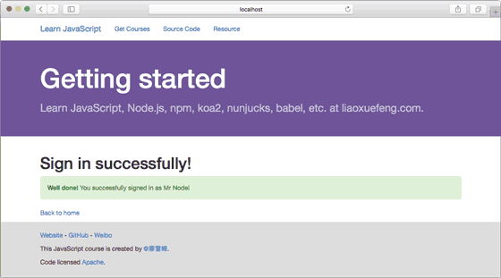
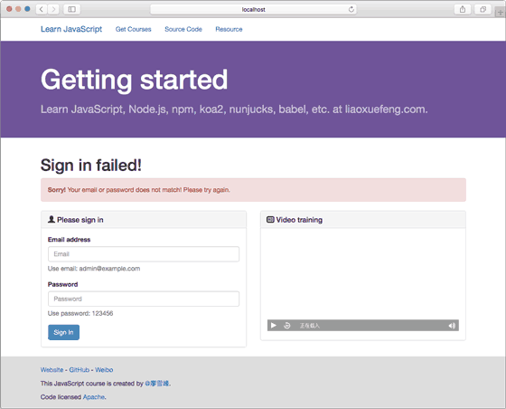

#9-6-1-4 使用MVC

##MVC

我们已经可以用koa处理不同的URL，还可以用Nunjucks渲染模板。现在，是时候把这两者结合起来了！

当用户通过浏览器请求一个URL时，koa将调用某个异步函数处理该URL。在这个异步函数内部，我们用一行代码：

	ctx.render('home.html', { name: 'Michael' });
通过Nunjucks把数据用指定的模板渲染成HTML，然后输出给浏览器，用户就可以看到渲染后的页面了：

这就是传说中的MVC：Model-View-Controller，中文名“模型-视图-控制器”。

异步函数是C：Controller，Controller负责业务逻辑，比如检查用户名是否存在，取出用户信息等等；

包含变量{{ name }}的模板就是V：View，View负责显示逻辑，通过简单地替换一些变量，View最终输出的就是用户看到的HTML。

MVC中的Model在哪？Model是用来传给View的，这样View在替换变量的时候，就可以从Model中取出相应的数据。

上面的例子中，Model就是一个JavaScript对象：

	{ name: 'Michael' }
下面，我们根据原来的url2-koa创建工程view-koa，把koa2、Nunjucks整合起来，然后，把原来直接输出字符串的方式，改为ctx.render(view, model)的方式。

工程view-koa结构如下：

	view-koa/
	|
	+- .vscode/
	|  |
	|  +- launch.json <-- VSCode 配置文件
	|
	+- controllers/ <-- Controller
	|
	+- views/ <-- html模板文件
	|
	+- static/ <-- 静态资源文件
	|
	+- controller.js <-- 扫描注册Controller
	|
	+- app.js <-- 使用koa的js
	|
	+- start.js <-- 启动入口js
	|
	+- package.json <-- 项目描述文件
	|
	+- node_modules/ <-- npm安装的所有依赖包
在package.json中，我们将要用到的依赖包有：

	"babel-core": "6.13.2",
	"babel-polyfill": "6.13.0",
	"babel-preset-es2015-node6": "0.3.0",
	"babel-preset-stage-3": "6.5.0",
	"koa": "2.0.0",
	"koa-bodyparser": "3.2.0",
	"koa-router": "7.0.0",
	"nunjucks": "2.4.2",
	"mime": "1.3.4",
	"mz": "2.4.0"
先用npm install安装依赖包。

然后，我们准备编写以下两个Controller：

##处理首页 GET /

我们定义一个async函数处理首页URL/：

	async (ctx, next) => {
	    ctx.render('index.html', {
	        title: 'Welcome'
	    });
	}
注意到koa并没有在ctx对象上提供render方法，这里我们假设应该这么使用，这样，我们在编写Controller的时候，最后一步调用ctx.render(view, model)就完成了页面输出。

##处理登录请求 POST /signin

我们再定义一个async函数处理登录请求/signin：

	async (ctx, next) => {
	    var
	        email = ctx.request.body.email || '',
	        password = ctx.request.body.password || '';
	    if (email === 'admin@example.com' && password === '123456') {
	        // 登录成功:
	        ctx.render('signin-ok.html', {
	            title: 'Sign In OK',
	            name: 'Mr Node'
	        });
	    } else {
	        // 登录失败:
	        ctx.render('signin-failed.html', {
	            title: 'Sign In Failed'
	        });
	    }
	}
由于登录请求是一个POST，我们就用ctx.request.body.<name>拿到POST请求的数据，并给一个默认值。

登录成功时我们用signin-ok.html渲染，登录失败时我们用signin-failed.html渲染，所以，我们一共需要以下3个View：

- index.html
- signin-ok.html
- signin-failed.html

##编写View

在编写View的时候，我们实际上是在编写HTML页。为了让页面看起来美观大方，使用一个现成的CSS框架是非常有必要的。我们用Bootstrap这个CSS框架。从首页下载zip包后解压，我们把所有静态资源文件放到/static目录下：
	
	view-koa/
	|
	+- static/
	   |
	   +- css/ <- 存放bootstrap.css等
	   |
	   +- fonts/ <- 存放字体文件
	   |
	   +- js/ <- 存放bootstrap.js等
这样我们在编写HTML的时候，可以直接用Bootstrap的CSS，像这样：

	<link rel="stylesheet" href="/static/css/bootstrap.css">
现在，在使用MVC之前，第一个问题来了，如何处理静态文件？

我们把所有静态资源文件全部放入/static目录，目的就是能统一处理静态文件。在koa中，我们需要编写一个middleware，处理以/static/开头的URL。

##编写middleware

我们来编写一个处理静态文件的middleware。编写middleware实际上一点也不复杂。我们先创建一个static-files.js的文件，编写一个能处理静态文件的middleware：

	const path = require('path');
	const mime = require('mime');
	const fs = require('mz/fs');
	
	// url: 类似 '/static/'
	// dir: 类似 __dirname + '/static'
	function staticFiles(url, dir) {
	    return async (ctx, next) => {
	        let rpath = ctx.request.path;
	        // 判断是否以指定的url开头:
	        if (rpath.startsWith(url)) {
	            // 获取文件完整路径:
	            let fp = path.join(dir, rpath.substring(url.length));
	            // 判断文件是否存在:
	            if (await fs.exists(fp)) {
	                // 查找文件的mime:
	                ctx.response.type = mime.lookup(rpath);
	                // 读取文件内容并赋值给response.body:
	                ctx.response.body = await fs.readFile(fp);
	            } else {
	                // 文件不存在:
	                ctx.response.status = 404;
	            }
	        } else {
	            // 不是指定前缀的URL，继续处理下一个middleware:
	            await next();
	        }
	    };
	}
	
	module.exports = staticFiles;
staticFiles是一个普通函数，它接收两个参数：URL前缀和一个目录，然后返回一个async函数。这个async函数会判断当前的URL是否以指定前缀开头，如果是，就把URL的路径视为文件，并发送文件内容。如果不是，这个async函数就不做任何事情，而是简单地调用await next()让下一个middleware去处理请求。

我们使用了一个mz的包，并通过require('mz/fs');导入。mz提供的API和Node.js的fs模块完全相同，但fs模块使用回调，而mz封装了fs对应的函数，并改为Promise。这样，我们就可以非常简单的用await调用mz的函数，而不需要任何回调。

所有的第三方包都可以通过npm官网搜索并查看其文档：

https://www.npmjs.com/

最后，这个middleware使用起来也很简单，在app.js里加一行代码：

	let staticFiles = require('./static-files');
	app.use(staticFiles('/static/', __dirname + '/static'));
注意：也可以去npm搜索能用于koa2的处理静态文件的包并直接使用。

##集成Nunjucks

集成Nunjucks实际上也是编写一个middleware，这个middleware的作用是给ctx对象绑定一个render(view, model)的方法，这样，后面的Controller就可以调用这个方法来渲染模板了。

我们创建一个templating.js来实现这个middleware：

	const nunjucks = require('nunjucks');
	
	function createEnv(path, opts) {
	    var
	        autoescape = opts.autoescape && true,
	        noCache = opts.noCache || false,
	        watch = opts.watch || false,
	        throwOnUndefined = opts.throwOnUndefined || false,
	        env = new nunjucks.Environment(
	            new nunjucks.FileSystemLoader('views', {
	                noCache: noCache,
	                watch: watch,
	            }), {
	                autoescape: autoescape,
	                throwOnUndefined: throwOnUndefined
	            });
	    if (opts.filters) {
	        for (var f in opts.filters) {
	            env.addFilter(f, opts.filters[f]);
	        }
	    }
	    return env;
	}
	
	function templating(path, opts) {
	    // 创建Nunjucks的env对象:
	    var env = createEnv(path, opts);
	    return async (ctx, next) => {
	        // 给ctx绑定render函数:
	        ctx.render = function (view, model) {
	            // 把render后的内容赋值给response.body:
	            ctx.response.body = env.render(view, Object.assign({}, ctx.state || {}, model || {}));
	            // 设置Content-Type:
	            ctx.response.type = 'text/html';
	        };
	        // 继续处理请求:
	        await next();
	    };
	}
	
	module.exports = templating;
注意到createEnv()函数和前面使用Nunjucks时编写的函数是一模一样的。我们主要关心tempating()函数，它会返回一个middleware，在这个middleware中，我们只给ctx“安装”了一个render()函数，其他什么事情也没干，就继续调用下一个middleware。

使用的时候，我们在app.js添加如下代码：

	const isProduction = process.env.NODE_ENV === 'production';
	
	app.use(templating('view', {
	    noCache: !isProduction,
	    watch: !isProduction
	}));
这里我们定义了一个常量isProduction，它判断当前环境是否是production环境。如果是，就使用缓存，如果不是，就关闭缓存。在开发环境下，关闭缓存后，我们修改View，可以直接刷新浏览器看到效果，否则，每次修改都必须重启Node程序，会极大地降低开发效率。

Node.js在全局变量process中定义了一个环境变量env.NODE_ENV，为什么要使用该环境变量？因为我们在开发的时候，环境变量应该设置为'development'，而部署到服务器时，环境变量应该设置为'production'。在编写代码的时候，要根据当前环境作不同的判断。

注意：生产环境上必须配置环境变量NODE_ENV = 'production'，而开发环境不需要配置，实际上NODE_ENV可能是undefined，所以判断的时候，不要用NODE_ENV === 'development'。

类似的，我们在使用上面编写的处理静态文件的middleware时，也可以根据环境变量判断：

	if (! isProduction) {
	    let staticFiles = require('./static-files');
	    app.use(staticFiles('/static/', __dirname + '/static'));
	}
这是因为在生产环境下，静态文件是由部署在最前面的反向代理服务器（如Nginx）处理的，Node程序不需要处理静态文件。而在开发环境下，我们希望koa能顺带处理静态文件，否则，就必须手动配置一个反向代理服务器，这样会导致开发环境非常复杂。

##编写View

在编写View的时候，非常有必要先编写一个base.html作为骨架，其他模板都继承自base.html，这样，才能大大减少重复工作。

编写HTML不在本教程的讨论范围之内。这里我们参考Bootstrap的官网简单编写了base.html。

运行

一切顺利的话，这个view-koa工程应该可以顺利运行。运行前，我们再检查一下app.js里的middleware的顺序：

第一个middleware是记录URL以及页面执行时间：
	
	app.use(async (ctx, next) => {
	    console.log(`Process ${ctx.request.method} ${ctx.request.url}...`);
	    var
	        start = new Date().getTime(),
	        execTime;
	    await next();
	    execTime = new Date().getTime() - start;
	    ctx.response.set('X-Response-Time', `${execTime}ms`);
	});
第二个middleware处理静态文件：

	if (! isProduction) {
	    let staticFiles = require('./static-files');
	    app.use(staticFiles('/static/', __dirname + '/static'));
	}
第三个middleware解析POST请求：

	app.use(bodyParser());
第四个middleware负责给ctx加上render()来使用Nunjucks：

	app.use(templating('view', {
	    noCache: !isProduction,
	    watch: !isProduction
	}));
最后一个middleware处理URL路由：

	app.use(controller());
现在，在VS Code中运行代码，不出意外的话，在浏览器输入localhost:3000/，可以看到首页内容：

直接在首页登录，如果输入正确的Email和Password，进入登录成功的页面：

如果输入的Email和Password不正确，进入登录失败的页面：

怎么判断正确的Email和Password？目前我们在signin.js中是这么判断的：

	if (email === 'admin@example.com' && password === '123456') {
	    ...
	}
当然，真实的网站会根据用户输入的Email和Password去数据库查询并判断登录是否成功，不过这需要涉及到Node.js环境如何操作数据库，我们后面再讨论。

##扩展

注意到ctx.render内部渲染模板时，Model对象并不是传入的model变量，而是：

	Object.assign({}, ctx.state || {}, model || {})
这个小技巧是为了扩展。

首先，model || {}确保了即使传入undefined，model也会变为默认值{}。Object.assign()会把除第一个参数外的其他参数的所有属性复制到第一个参数中。第二个参数是ctx.state || {}，这个目的是为了能把一些公共的变量放入ctx.state并传给View。

例如，某个middleware负责检查用户权限，它可以把当前用户放入ctx.state中：

	app.use(async (ctx, next) => {
	    var user = tryGetUserFromCookie(ctx.request);
	    if (user) {
	        ctx.state.user = user;
	        await next();
	    } else {
	        ctx.response.status = 403;
	    }
	});
这样就没有必要在每个Controller的async函数中都把user变量放入model中。

##参考源码

- 本地

[view-koa](../code/chapter9/9-6-1-4-view-koa.7z)

- github

[view-koa](https://github.com/michaelliao/learn-javascript/tree/master/samples/node/web/koa/view-koa)