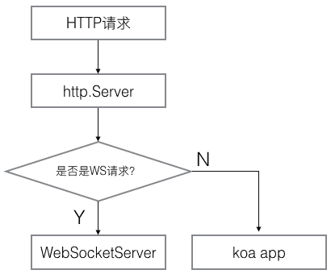
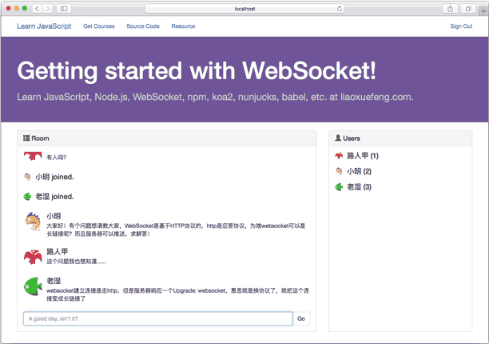

#9-6-4-2 编写聊天室

上一节我们用ws模块创建了一个WebSocket应用。但是它只能简单地响应ECHO: xxx消息，还属于Hello, world级别的应用。

要创建真正的WebSocket应用，首先，得有一个基于MVC的Web应用，也就是我们在前面用koa2和Nunjucks创建的Web，在此基础上，把WebSocket添加进来，才算完整。

因此，本节的目标是基于WebSocket创建一个在线聊天室。

首先，我们把前面编写的MVC工程复制一份，先创建一个完整的MVC的Web应用，结构如下：

	ws-with-koa/
	|
	+- .vscode/
	|  |
	|  +- launch.json <-- VSCode 配置文件
	|
	+- controllers/ <-- Controller
	|
	+- views/ <-- html模板文件
	|
	+- static/ <-- 静态资源文件
	|
	+- app.js <-- 使用koa的js
	|
	+- start.js <-- 启动入口js
	|
	+- controller.js <-- 扫描注册Controller
	|
	+- static-files.js <-- 处理静态文件
	|
	+- templating.js <-- 模版引擎入口
	|
	+- package.json <-- 项目描述文件
	|
	+- node_modules/ <-- npm安装的所有依赖包
然后，把我们需要的依赖包添加到package.json：

	"dependencies": {
	    "babel-core": "6.13.2",
	    "babel-polyfill": "6.13.0",
	    "babel-preset-es2015-node6": "0.3.0",
	    "babel-preset-stage-3": "6.5.0",
	    "ws": "1.1.1",
	    "koa": "2.0.0",
	    "koa-bodyparser": "3.2.0",
	    "koa-router": "7.0.0",
	    "nunjucks": "2.4.2",
	    "mime": "1.3.4",
	    "mz": "2.4.0"
	}
使用npm install安装后，我们首先得到了一个标准的基于MVC的koa2应用。该应用的核心是一个代表koa应用的app变量：

	const app = new Koa();
	
	// TODO: app.use(...);
	
	app.listen(3000);
现在第一个问题来了：koa通过3000端口响应HTTP，我们要新加的WebSocketServer还能否使用3000端口？

答案是肯定的。虽然WebSocketServer可以使用别的端口，但是，统一端口有个最大的好处：

实际应用中，HTTP和WebSocket都使用标准的80和443端口，不需要暴露新的端口，也不需要修改防火墙规则。

在3000端口被koa占用后，WebSocketServer如何使用该端口？

实际上，3000端口并非由koa监听，而是koa调用Node标准的http模块创建的http.Server监听的。koa只是把响应函数注册到该http.Server中了。类似的，WebSocketServer也可以把自己的响应函数注册到http.Server中，这样，同一个端口，根据协议，可以分别由koa和ws处理：

把WebSocketServer绑定到同一个端口的关键代码是先获取koa创建的http.Server的引用，再根据http.Server创建WebSocketServer：

	// koa app的listen()方法返回http.Server:
	let server = app.listen(3000);
	
	// 创建WebSocketServer:
	let wss = new WebSocketServer({
	    server: server
	});
要始终注意，浏览器创建WebSocket时发送的仍然是标准的HTTP请求。无论是WebSocket请求，还是普通HTTP请求，都会被http.Server处理。具体的处理方式则是由koa和WebSocketServer注入的回调函数实现的。WebSocketServer会首先判断请求是不是WS请求，如果是，它将处理该请求，如果不是，该请求仍由koa处理。

所以，WS请求会直接由WebSocketServer处理，它根本不会经过koa，koa的任何middleware都没有机会处理该请求。

现在第二个问题来了：在koa应用中，可以很容易地认证用户，例如，通过session或者cookie，但是，在响应WebSocket请求时，如何识别用户身份？

一个简单可行的方案是把用户登录后的身份写入Cookie，在koa中，可以使用middleware解析Cookie，把用户绑定到ctx.state.user上。

WS请求也是标准的HTTP请求，所以，服务器也会把Cookie发送过来，这样，我们在用WebSocketServer处理WS请求时，就可以根据Cookie识别用户身份。

先把识别用户身份的逻辑提取为一个单独的函数：

	function parseUser(obj) {
	    if (!obj) {
	        return;
	    }
	    console.log('try parse: ' + obj);
	    let s = '';
	    if (typeof obj === 'string') {
	        s = obj;
	    } else if (obj.headers) {
	        let cookies = new Cookies(obj, null);
	        s = cookies.get('name');
	    }
	    if (s) {
	        try {
	            let user = JSON.parse(Buffer.from(s, 'base64').toString());
	            console.log(`User: ${user.name}, ID: ${user.id}`);
	            return user;
	        } catch (e) {
	            // ignore
	        }
	    }
	}
注意：出于演示目的，该Cookie并没有作Hash处理，实际上它就是一个JSON字符串。

在koa的middleware中，我们很容易识别用户：

	app.use(async (ctx, next) => {
	    ctx.state.user = parseUser(ctx.cookies.get('name') || '');
	    await next();
	});
在WebSocketServer中，就需要响应connection事件，然后识别用户：

	wss.on('connection', function (ws) {
	    // ws.upgradeReq是一个request对象:
	    let user = parseUser(ws.upgradeReq);
	    if (!user) {
	        // Cookie不存在或无效，直接关闭WebSocket:
	        ws.close(4001, 'Invalid user');
	    }
	    // 识别成功，把user绑定到该WebSocket对象:
	    ws.user = user;
	    // 绑定WebSocketServer对象:
	    ws.wss = wss;
	});
紧接着，我们要对每个创建成功的WebSocket绑定message、close、error等事件处理函数。对于聊天应用来说，每收到一条消息，就需要把该消息广播到所有WebSocket连接上。

先为wss对象添加一个broadcase()方法：

	wss.broadcast = function (data) {
	    wss.clients.forEach(function (client) {
	        client.send(data);
	    });
	};
在某个WebSocket收到消息后，就可以调用wss.broadcast()进行广播了：

	ws.on('message', function (message) {
	    console.log(message);
	    if (message && message.trim()) {
	        let msg = createMessage('chat', this.user, message.trim());
	        this.wss.broadcast(msg);
	    }
	});
消息有很多类型，不一定是聊天的消息，还可以有获取用户列表、用户加入、用户退出等多种消息。所以我们用createMessage()创建一个JSON格式的字符串，发送给浏览器，浏览器端的JavaScript就可以直接使用：

	// 消息ID:
	var messageIndex = 0;
	
	function createMessage(type, user, data) {
	    messageIndex ++;
	    return JSON.stringify({
	        id: messageIndex,
	        type: type,
	        user: user,
	        data: data
	    });
	}
##编写页面

相比服务器端的代码，页面的JavaScript代码会更复杂。

聊天室页面可以划分为左侧会话列表和右侧用户列表两部分：

这里的DOM需要动态更新，因此，状态管理是页面逻辑的核心。

为了简化状态管理，我们用Vue控制左右两个列表：

	var vmMessageList = new Vue({
	    el: '#message-list',
	    data: {
	        messages: []
	    }
	});
	
	var vmUserList = new Vue({
	    el: '#user-list',
	    data: {
	        users: []
	    }
	});
会话列表和用户列表初始化为空数组。

紧接着，创建WebSocket连接，响应服务器消息，并且更新会话列表和用户列表：

	var ws = new WebSocket('ws://localhost:3000/ws/chat');
	
	ws.onmessage = function(event) {
	    var data = event.data;
	    console.log(data);
	    var msg = JSON.parse(data);
	    if (msg.type === 'list') {
	        vmUserList.users = msg.data;
	    } else if (msg.type === 'join') {
	        addToUserList(vmUserList.users, msg.user);
	        addMessage(vmMessageList.messages, msg);
	    } else if (msg.type === 'left') {
	        removeFromUserList(vmUserList.users, msg.user);
	        addMessage(vmMessageList.messages, msg);
	    } else if (msg.type === 'chat') {
	        addMessage(vmMessageList.messages, msg);
	    }
	};
这样，JavaScript负责更新状态，Vue负责根据状态刷新DOM。以用户列表为例，HTML代码如下：

	

	    

	        

	            
	        

	        

	            <h4 class="media-heading" v-text="user.name"></h4>
	        

	    

	

测试的时候，如果在本机测试，需要同时用几个不同的浏览器，这样Cookie互不干扰。

最终的聊天室效果如下：

##配置反向代理

如果网站配置了反向代理，例如Nginx，则HTTP和WebSocket都必须通过反向代理连接Node服务器。HTTP的反向代理非常简单，但是要正常连接WebSocket，代理服务器必须支持WebSocket协议。

我们以Nginx为例，编写一个简单的反向代理配置文件。

详细的配置可以参考Nginx的官方博客：Using NGINX as a WebSocket Proxy

首先要保证Nginx版本>=1.3，然后，通过proxy_set_header指令，设定：

	proxy_set_header Upgrade $http_upgrade;
	proxy_set_header Connection "upgrade";
Nginx即可理解该连接将使用WebSocket协议。

一个示例配置文件内容如下：

	server {
	    listen      80;
	    server_name localhost;
	
	    # 处理静态资源文件:
	    location ^~ /static/ {
	        root /path/to/ws-with-koa;
	    }
	
	    # 处理WebSocket连接:
	    location ^~ /ws/ {
	        proxy_pass         http://127.0.0.1:3000;
	        proxy_http_version 1.1;
	        proxy_set_header   Upgrade $http_upgrade;
	        proxy_set_header   Connection "upgrade";
	    }
	
	    # 其他所有请求:
	    location / {
	        proxy_pass       http://127.0.0.1:3000;
	        proxy_set_header X-Real-IP $remote_addr;
	        proxy_set_header Host $host;
	        proxy_set_header X-Forwarded-For $proxy_add_x_forwarded_for;
	    }
	}
##参考源码

[ws-with-koa](https://github.com/michaelliao/learn-javascript/tree/master/samples/node/web/ws/ws-with-koa)