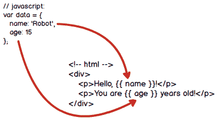
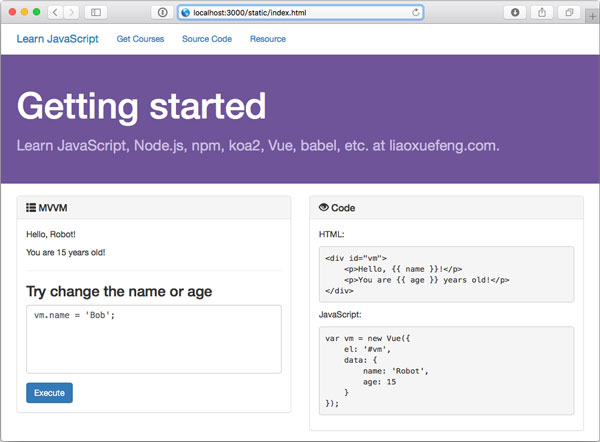

#9-6-6-1 单向绑定

MVVM就是在前端页面上，应用了扩展的MVC模式，我们关心Model的变化，MVVM框架自动把Model的变化映射到DOM结构上，这样，用户看到的页面内容就会随着Model的变化而更新。

例如，我们定义好一个JavaScript对象作为Model，并且把这个Model的两个属性绑定到DOM节点上：

经过MVVM框架的自动转换，浏览器就可以直接显示Model的数据了：

现在问题来了：MVVM框架哪家强？

目前，常用的MVVM框架有：

Angular：Google出品，名气大，但是很难用；

Backbone.js：入门非常困难，因为自身API太多；

Ember：一个大而全的框架，想写个Hello world都很困难。

我们选择MVVM的目标应该是入门容易，安装简单，能直接在页面写JavaScript，需要更复杂的功能时又能扩展支持。

所以，综合考察，最佳选择是尤雨溪大神开发的MVVM框架：Vue.js

目前，Vue.js的最新版本是2.0，我们会使用2.0版本作为示例。

我们首先创建基于koa的Node.js项目。虽然目前我们只需要在HTML静态页面中编写MVVM，但是很快我们就需要和后端API进行交互，因此，要创建基于koa的项目结构如下：

	hello-vue/
	|
	+- .vscode/
	|  |
	|  +- launch.json <-- VSCode 配置文件
	|
	+- app.js <-- koa app
	|
	+- start.js <-- 入口js
	|
	+- static-files.js <-- 支持静态文件的koa middleware
	|
	+- package.json <-- 项目描述文件
	|
	+- node_modules/ <-- npm安装的所有依赖包
	|
	+- static/ <-- 存放静态资源文件
	   |
	   +- css/ <-- 存放bootstrap.css等
	   |
	   +- fonts/ <-- 存放字体文件
	   |
	   +- js/ <-- 存放各种js文件
	   |
	   +- index.html <-- 使用MVVM的静态页面
这个Node.js项目的主要目的是作为服务器输出静态网页，因此，package.json仅需要如下依赖包：

	"dependencies": {
	    "babel-core": "6.13.2",
	    "babel-polyfill": "6.13.0",
	    "babel-preset-es2015-node6": "0.3.0",
	    "babel-preset-stage-3": "6.5.0",
	    "koa": "2.0.0",
	    "mime": "1.3.4",
	    "mz": "2.4.0"
	}
使用npm install安装好依赖包，然后启动start.js，在index.html文件中随便写点内容，确保浏览器可以通过`http://localhost:3000/static/index.html`访问到该静态文件。

紧接着，我们在index.html中用Vue实现MVVM的一个简单例子。

##安装Vue

安装Vue有很多方法，可以用npm或者webpack。但是我们现在的目标是尽快用起来，所以最简单的方法是直接在HTML代码中像引用jQuery一样引用Vue。可以直接使用CDN的地址，例如：

	
也可以把vue.js文件下载下来，放到项目的/static/js文件夹中，使用本地路径：

	
这里需要注意，vue.js是未压缩的用于开发的版本，它会在浏览器console中输出很多有用的信息，帮助我们调试代码。当开发完毕，需要真正发布到服务器时，应该使用压缩过的vue.min.js，它会移除所有调试信息，并且文件体积更小。

##编写MVVM

下一步，我们就可以在HTML页面中编写JavaScript代码了。我们的Model是一个JavaScript对象，它包含两个属性：

	{
	    name: 'Robot',
	    age: 15
	}
而负责显示的是DOM节点可以用{{ name }}和{{ age}}来引用Model的属性：

	

	    
Hello, {{ name }}!

	    
You are {{ age }} years old!

	

最后一步是用Vue把两者关联起来。要特别注意的是，在<head>内部编写的JavaScript代码，需要用jQuery把MVVM的初始化代码推迟到页面加载完毕后执行，否则，直接在<head>内执行MVVM代码时，DOM节点尚未被浏览器加载，初始化将失败。正确的写法如下：

	<html>
	<head>
	
	<!-- 引用jQuery -->
	
	
	<!-- 引用Vue -->
	
	
	
	
	</head>
	
	<body>
	
	    

	        
Hello, {{ name }}!

	        
You are {{ age }} years old!

	    

	
	</body>
	<html>
我们创建一个VM的核心代码如下：

	var vm = new Vue({
	    el: '#vm',
	    data: {
	        name: 'Robot',
	        age: 15
	    }
	});
其中，el指定了要把Model绑定到哪个DOM根节点上，语法和jQuery类似。这里的'#vm'对应ID为vm的一个
节点：

	

	    ...
	

在该节点以及该节点内部，就是Vue可以操作的View。Vue可以自动把Model的状态映射到View上，但是不能操作View范围之外的其他DOM节点。

然后，data属性指定了Model，我们初始化了Model的两个属性name和age，在View内部的
节点上，可以直接用{{ name }}引用Model的某个属性。

一切正常的话，我们在浏览器中访问`http://localhost:3000/static/index.html`，可以看到页面输出为：

	Hello, Robot!
	You are 15 years old!
如果打开浏览器console，因为我们用代码window.vm = vm，把VM变量绑定到了window对象上，所以，可以直接修改VM的Model：

	window.vm.name = 'Bob'
执行上述代码，可以观察到页面立刻发生了变化，原来的Hello, Robot!自动变成了Hello, Bob!。Vue作为MVVM框架会自动监听Model的任何变化，在Model数据变化时，更新View的显示。这种Model到View的绑定我们称为单向绑定。

经过CSS修饰后的页面如下：

可以在页面直接输入JavaScript代码改变Model，并观察页面变化。

##单向绑定

在Vue中，可以直接写{{ name }}绑定某个属性。如果属性关联的是对象，还可以用多个.引用，例如，{{ address.zipcode }}。

另一种单向绑定的方法是使用Vue的指令v-text，写法如下：

	
Hello, !

这种写法是把指令写在HTML节点的属性上，它会被Vue解析，该节点的文本内容会被绑定为Model的指定属性，注意不能再写双花括号`{{ }}`。

##参考源码

- 本地

[hello-vue](../code/chapter9/9-6-6-1-hello-vue.7z)

- github

[hello-vue](https://github.com/michaelliao/learn-javascript/tree/master/samples/node/web/vue/hello-vue)