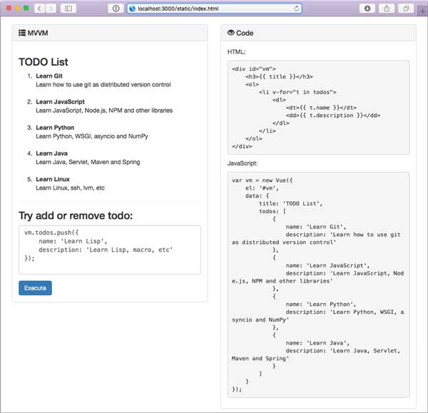

#9-6-6-3 同步DOM结构

除了简单的单向绑定和双向绑定，MVVM还有一个重要的用途，就是让Model和DOM的结构保持同步。

我们用一个TODO的列表作为示例，从用户角度看，一个TODO列表在DOM结构的表现形式就是一组`<li>`节点：

	<ol>
	    <li>
	        <dl>
	            <dt>产品评审</dt>
	            <dd>新款iPhone上市前评审</dd>
	        </dl>
	    </li>
	    <li>
	        <dl>
	            <dt>开发计划</dt>
	            <dd>与PM确定下一版Android开发计划</dd>
	        </dl>
	    </li>
	    <li>
	        <dl>
	            <dt>VC会议</dt>
	            <dd>敲定C轮5000万美元融资</dd>
	        </dl>
	    </li>
	</ol>
而对应的Model可以用JavaScript数组表示：

	todos: [
	    {
	        name: '产品评审',
	        description: '新款iPhone上市前评审'
	    },
	    {
	        name: '开发计划',
	        description: '与PM确定下一版Android开发计划'
	    },
	    {
	        name: 'VC会议',
	        description: '敲定C轮5000万美元融资'
	    }
	]
使用MVVM时，当我们更新Model时，DOM结构会随着Model的变化而自动更新。当todos数组增加或删除元素时，相应的DOM节点会增加`<li>`或者删除`<li>`节点。

在Vue中，可以使用v-for指令来实现：
	
	<ol>
	    <li v-for="t in todos">
	        <dl>
	            <dt>{{ t.name }}</dt>
	            <dd>{{ t.description }}</dd>
	        </dl>
	    </li>
	</ol>
v-for指令把数组和一组`<li>`元素绑定了。在<li>元素内部，用循环变量t引用某个属性，例如，`{{ t.name }}`。这样，我们只关心如何更新Model，不关心如何增删DOM节点，大大简化了整个页面的逻辑。

我们可以在浏览器console中用window.vm.todos[0].name='计划有变'查看View的变化，或者通过window.vm.todos.push({name:'新计划',description:'blabla...'})来增加一个数组元素，从而自动添加一个`<li>`元素。

需要注意的是，Vue之所以能够监听Model状态的变化，是因为JavaScript语言本身提供了Proxy或者Object.observe()机制来监听对象状态的变化。但是，对于数组元素的赋值，却没有办法直接监听，因此，如果我们直接对数组元素赋值：

	vm.todos[0] = {
	    name: 'New name',
	    description: 'New description'
	};
会导致Vue无法更新View。

正确的方法是不要对数组元素赋值，而是更新：

	vm.todos[0].name = 'New name';
	vm.todos[0].description = 'New description';
或者，通过splice()方法，删除某个元素后，再添加一个元素，达到“赋值”的效果：

	var index = 0;
	var newElement = {...};
	vm.todos.splice(index, 1, newElement);
Vue可以监听数组的splice、push、unshift等方法调用，所以，上述代码可以正确更新View。

用CSS修饰后的页面效果如下：

##参考源码

- 本地

[vue-todo](../code/chapter9/9-6-6-3-vue-todo.7z)

- github

[vue-todo](https://github.com/michaelliao/learn-javascript/tree/master/samples/node/web/vue/vue-todo)