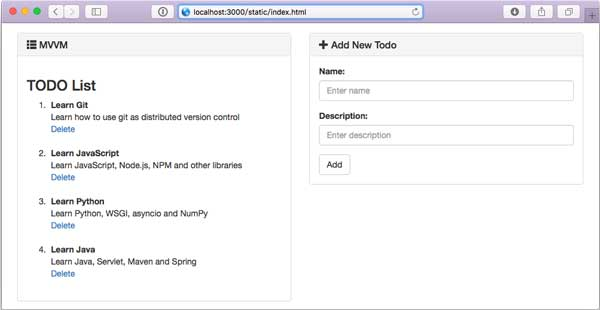

#9-6-6-4 集成API

在上一节中，我们用Vue实现了一个简单的TODO应用。通过对Model的更新，DOM结构可以同步更新。

现在，如果要把这个简单的TODO应用变成一个用户能使用的Web应用，我们需要解决几个问题：

1. 用户的TODO数据应该从后台读取；
2. 对TODO的增删改必须同步到服务器后端；
3. 用户在View上必须能够修改TODO。

第1个和第2个问题都是和API相关的。只要我们实现了合适的API接口，就可以在MVVM内部更新Model的同时，通过API把数据更新反映到服务器端，这样，用户数据就保存到了服务器端，下次打开页面时就可以读取TODO列表。

我们在vue-todo的基础上创建vue-todo-2项目，结构如下：

	vue-todo-2/
	|
	+- .vscode/
	|  |
	|  +- launch.json <-- VSCode 配置文件
	|
	+- app.js <-- koa app
	|
	+- start.js <-- 入口js
	|
	+- static-files.js <-- 支持静态文件的koa middleware
	|
	+- controller.js <-- 支持路由的koa middleware
	|
	+- rest.js <-- 支持REST的koa middleware
	|
	+- package.json <-- 项目描述文件
	|
	+- node_modules/ <-- npm安装的所有依赖包
	|
	+- controllers/ <-- 存放Controller
	|  |
	|  +- api.js <-- REST API
	|
	+- static/ <-- 存放静态资源文件
	   |
	   +- css/ <-- 存放bootstrap.css等
	   |
	   +- fonts/ <-- 存放字体文件
	   |
	   +- js/ <-- 存放各种js文件
	   |
	   +- index.html <-- 使用MVVM的静态页面
在api.js文件中，我们用数组在服务器端模拟一个数据库，然后实现以下4个API：

- GET /api/todos：返回所有TODO列表；
- POST /api/todos：创建一个新的TODO，并返回创建后的对象；
- PUT /api/todos/:id：更新一个TODO，并返回更新后的对象；
- DELETE /api/todos/:id：删除一个TODO。

和上一节的TODO数据结构相比，我们需要增加一个id属性，来唯一标识一个TODO。

准备好API后，在Vue中，我们如何把Model的更新同步到服务器端？

有两个方法，一是直接用jQuery的AJAX调用REST API，不过这种方式比较麻烦。

第二个方法是使用vue-resource这个针对Vue的扩展，它可以给VM对象加上一个$resource属性，通过$resource来方便地操作API。

使用vue-resource只需要在导入vue.js后，加一行`
我们给VM增加一个init()方法，读取TODO列表：

	var vm = new Vue({
	    el: '#vm',
	    data: {
	        title: 'TODO List',
	        todos: []
	    },
	    created: function () {
	        this.init();
	    },
	    methods: {
	        init: function () {
	            var that = this;
	            that.$resource('/api/todos').get().then(function (resp) {
	                // 调用API成功时调用json()异步返回结果:
	                resp.json().then(function (result) {
	                    // 更新VM的todos:
	                    that.todos = result.todos;
	                });
	            }, function (resp) {
	                // 调用API失败:
	                alert('error');
	            });
	        }
	    }
	});
注意到创建VM时，created指定了当VM初始化成功后的回调函数，这样，init()方法会被自动调用。

类似的，对于添加、修改、删除的操作，我们也需要往VM中添加对应的函数。以添加为例：

	var vm = new Vue({
	    ...
	    methods: {
	        ...
	        create: function (todo) {
	            var that = this;
	            that.$resource('/api/todos').save(todo).then(function (resp) {
	                resp.json().then(function (result) {
	                    that.todos.push(result);
	                });
	            }, showError);
	        },
	        update: function (todo, prop, e) {
	            ...
	        },
	        remove: function (todo) {
	            ...
	        }
	    }
	});
添加操作需要一个额外的表单，我们可以创建另一个VM对象vmAdd来对表单作双向绑定，然后，在提交表单的事件中调用vm对象的create方法：

	var vmAdd = new Vue({
	    el: '#vmAdd',
	    data: {
	        name: '',
	        description: ''
	    },
	    methods: {
	        submit: function () {
	            vm.create(this.$data);
	        }
	    }
	});
vmAdd和FORM表单绑定：

	<form id="vmAdd" action="#0" v-on:submit.prevent="submit">
	    
<input type="text" v-model="name">

	    
<input type="text" v-model="description">

	    
<button type="submit">Add</button>

	</form>
最后，把vm绑定到对应的DOM：

	

	    <h3>{{ title }}</h3>
	    <ol>
	        <li v-for="t in todos">
	            <dl>
	                <dt contenteditable="true" v-on:blur="update(t, 'name', $event)">{{ t.name }}</dt>
	                <dd contenteditable="true" v-on:blur="update(t, 'description', $event)">{{ t.description }}</dd>
	                <dd><a href="#0" v-on:click="remove(t)">Delete</a></dd>
	            </dl>
	        </li>
	    </ol>
	

这里我们用contenteditable="true"让DOM节点变成可编辑的，用v-on:blur="update(t, 'name', $event)"在编辑结束时调用update()方法并传入参数，特殊变量$event表示DOM事件本身。

删除TODO是通过对`<a>`节点绑定v-on:click事件并调用remove()方法实现的。

如果一切无误，我们就可以先启动服务器，然后在浏览器中访问`http://localhost:3000/static/index.html`，对TODO进行增删改等操作，操作结果会保存在服务器端。

通过Vue和vue-resource插件，我们用简单的几十行代码就实现了一个真正可用的TODO应用。

使用CSS修饰后的页面效果如下：

##参考源码

- 本地

[vue-todo-2](../code/chapter9/9-6-6-4-vue-todo2.7z)

- github

[vue-todo-2](https://github.com/michaelliao/learn-javascript/tree/master/samples/node/web/vue/vue-todo-2)