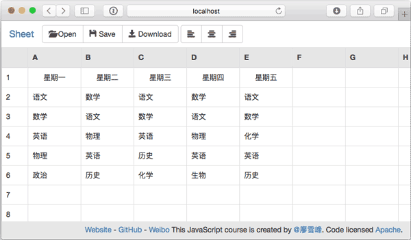

#9-6-5 在线电子表格

利用MVVM，很多非常复杂的前端页面编写起来就非常容易了。这得益于我们把注意力放在Model的结构上，而不怎么关心DOM的操作。

本节我们演示如何利用Vue快速创建一个在线电子表格：

首先，我们定义Model的结构，它的主要数据就是一个二维数组，每个单元格用一个JavaScript对象表示：

	data: {
	    title: 'New Sheet',
	    header: [ // 对应首行 A, B, C...
	        { row: 0, col: 0, text: '' },
	        { row: 0, col: 1, text: 'A' },
	        { row: 0, col: 2, text: 'B' },
	        { row: 0, col: 3, text: 'C' },
	        ...
	        { row: 0, col: 10, text: 'J' }
	    ],
	    rows: [
	        [
	            { row: 1, col: 0, text: '1' },
	            { row: 1, col: 1, text: '' },
	            { row: 1, col: 2, text: '' },
	            ...
	            { row: 1, col: 10, text: '' },
	        ],
	        [
	            { row: 2, col: 0, text: '2' },
	            { row: 2, col: 1, text: '' },
	            { row: 2, col: 2, text: '' },
	            ...
	            { row: 2, col: 10, text: '' },
	        ],
	        ...
	        [
	            { row: 10, col: 0, text: '10' },
	            { row: 10, col: 1, text: '' },
	            { row: 10, col: 2, text: '' },
	            ...
	            { row: 10, col: 10, text: '' },
	        ]
	    ],
	    selectedRowIndex: 0, // 当前活动单元格的row
	    selectedColIndex: 0 // 当前活动单元格的col
	}
紧接着，我们就可以把Model的结构映射到一个`<table>`上：

	<table id="sheet">
	    <thead>
	        <tr>
	            <th v-for="cell in header" v-text="cell.text"></th>
	        </tr>
	    </thead>
	    <tbody>
	        <tr v-for="tr in rows">
	            <td v-for="cell in tr" v-text="cell.text"></td>
	        </tr>
	    </tbody>
	</table>
现在，用Vue把Model和View关联起来，这个电子表格的原型已经可以运行了！

下一步，我们想在单元格内输入一些文本，怎么办？

因为不是所有单元格都可以被编辑，首行和首列不行。首行对应的是`<th>`，默认是不可编辑的，首列对应的是第一列的`<td>`，所以，需要判断某个`<td>`是否可编辑，我们用v-bind指令给某个DOM元素绑定对应的HTML属性：

	<td v-for="cell in tr" v-bind:contenteditable="cell.contentEditable" v-text="cell.text"></td>
在Model中给每个单元格对象加上contentEditable属性，就可以决定哪些单元格可编辑。

最后，给`<td>`绑定click事件，记录当前活动单元格的row和col，再绑定blur事件，在单元格内容编辑结束后更新Model：

	<td v-for="cell in tr" v-on:click="focus(cell)" v-on:blur="change" ...></td>
对应的两个方法要添加到VM中：

	var vm = new Vue({
	    ...
	    methods: {
	        focus: function (cell) {
	            this.selectedRowIndex = cell.row;
	            this.selectedColIndex = cell.col;
	        },
	        change: function (e) {
	            // change事件传入的e是DOM事件
	            var
	                rowIndex = this.selectedRowIndex,
	                colIndex = this.selectedColIndex,
	                text;
	            if (rowIndex > 0 && colIndex > 0) {
	                text = e.target.innerText; // 获取td的innerText
	                this.rows[rowIndex - 1][colIndex].text = text;
	            }
	        }
	    }
	});
现在，单元格已经可以编辑，并且用户的输入会自动更新到Model中。

如果我们要给单元格的文本添加格式，例如，左对齐或右对齐，可以给Model对应的对象添加一个align属性，然后用v-bind:style绑定到<td>上：

	<td v-for="cell in tr" ... v-bind:style="{ textAlign: cell.align }"></td>
然后，创建工具栏，给左对齐、居中对齐和右对齐按钮编写click事件代码，调用setAlign()函数：

	function setAlign(align) {
	    var
	        rowIndex = vm.selectedRowIndex,
	        colIndex = vm.selectedColIndex,
	        row, cell;
	    if (rowIndex > 0 && colIndex > 0) {
	        row = vm.rows[rowIndex - 1];
	        cell = row[colIndex];
	        cell.align = align;
	    }
	}
	
	// 给按钮绑定事件:
	$('#cmd-left').click(function () { setAlign('left'); });
	$('#cmd-center').click(function () { setAlign('center'); });
	$('#cmd-right').click(function () { setAlign('right'); });
现在，点击某个单元格，再点击右对齐按钮，单元格文本就变成右对齐了。

类似的，可以继续添加其他样式，例如字体、字号等。

##MVVM的适用范围

从几个例子我们可以看到，MVVM最大的优势是编写前端逻辑非常复杂的页面，尤其是需要大量DOM操作的逻辑，利用MVVM可以极大地简化前端页面的逻辑。

但是MVVM不是万能的，它的目的是为了解决复杂的前端逻辑。对于以展示逻辑为主的页面，例如，新闻，博客、文档等，不能使用MVVM展示数据，因为这些页面需要被搜索引擎索引，而搜索引擎无法获取使用MVVM并通过API加载的数据。

所以，需要SEO（Search Engine Optimization）的页面，不能使用MVVM展示数据。不需要SEO的页面，如果前端逻辑复杂，就适合使用MVVM展示数据，例如，工具类页面，复杂的表单页面，用户登录后才能操作的页面等等。

##参考源码

[mini-excel](https://github.com/michaelliao/learn-javascript/tree/master/samples/node/web/vue/mini-excel)