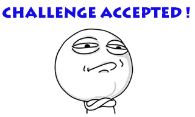

#Python 2.7教程

这是小白的Python新手教程。

Python是一种计算机程序设计语言。你可能已经听说过很多种流行的编程语言，比如非常难学的C语言，非常流行的Java语言，适合初学者的Basic语言，适合网页编程的JavaScript语言等等。

那Python是一种什么语言？

首先，我们普及一下编程语言的基础知识。用任何编程语言来开发程序，都是为了让计算机干活，比如下载一个MP3，编写一个文档等等，而计算机干活的CPU只认识机器指令，所以，尽管不同的编程语言差异极大，最后都得“翻译”成CPU可以执行的机器指令。而不同的编程语言，干同一个活，编写的代码量，差距也很大。

比如，完成同一个任务，C语言要写1000行代码，Java只需要写100行，而Python可能只要20行。

所以Python是一种相当高级的语言。

你也许会问，代码少还不好？代码少的代价是运行速度慢，C程序运行1秒钟，Java程序可能需要2秒，而Python程序可能就需要10秒。

那是不是越低级的程序越难学，越高级的程序越简单？表面上来说，是的，但是，在非常高的抽象计算中，高级的Python程序设计也是非常难学的，所以，高级程序语言不等于简单。

但是，对于初学者和完成普通任务，Python语言是非常简单易用的。连Google都在大规模使用Python，你就不用担心学了会没用。

用Python可以做什么？可以做日常任务，比如自动备份你的MP3；可以做网站，很多著名的网站包括YouTube就是Python写的；可以做网络游戏的后台，很多在线游戏的后台都是Python开发的。总之就是能干很多很多事啦。

Python当然也有不能干的事情，比如写操作系统，这个只能用C语言写；写手机应用，只能用Objective-C（针对iPhone）和Java（针对Android）；写3D游戏，最好用C或C++。

如果你是小白用户，满足以下条件：

会使用电脑，但从来没写过程序；
还记得初中数学学的方程式和一点点代数知识；
想从编程小白变成专业的软件架构师；
每天能抽出半个小时学习。
不要再犹豫了，这个教程就是为你准备的！

准备好了吗？

关于作者

[廖雪峰](http://weibo.com/liaoxuefeng)，十年软件开发经验，业余产品经理，精通Java/Python/Ruby/Visual Basic/Objective C等，对开源框架有深入研究，著有《Spring 2.0核心技术与最佳实践》一书，多个业余开源项目托管在[GitHub](https://github.com/michaelliao)，欢迎微博交流：

