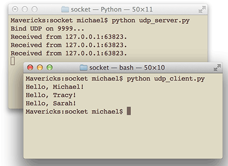

#18-3 UDP编程

TCP是建立可靠连接，并且通信双方都可以以流的形式发送数据。相对TCP，UDP则是面向无连接的协议。

使用UDP协议时，不需要建立连接，只需要知道对方的IP地址和端口号，就可以直接发数据包。但是，能不能到达就不知道了。

虽然用UDP传输数据不可靠，但它的优点是和TCP比，速度快，对于不要求可靠到达的数据，就可以使用UDP协议。

我们来看看如何通过UDP协议传输数据。和TCP类似，使用UDP的通信双方也分为客户端和服务器。服务器首先需要绑定端口：

	s = socket.socket(socket.AF_INET, socket.SOCK_DGRAM)
	# 绑定端口:
	s.bind(('127.0.0.1', 9999))
创建Socket时，SOCK_DGRAM指定了这个Socket的类型是UDP。绑定端口和TCP一样，但是不需要调用listen()方法，而是直接接收来自任何客户端的数据：

	print 'Bind UDP on 9999...'
	while True:
	    # 接收数据:
	    data, addr = s.recvfrom(1024)
	    print 'Received from %s:%s.' % addr
	    s.sendto('Hello, %s!' % data, addr)
recvfrom()方法返回数据和客户端的地址与端口，这样，服务器收到数据后，直接调用sendto()就可以把数据用UDP发给客户端。

注意这里省掉了多线程，因为这个例子很简单。

客户端使用UDP时，首先仍然创建基于UDP的Socket，然后，不需要调用connect()，直接通过sendto()给服务器发数据：

	s = socket.socket(socket.AF_INET, socket.SOCK_DGRAM)
	for data in ['Michael', 'Tracy', 'Sarah']:
	    # 发送数据:
	    s.sendto(data, ('127.0.0.1', 9999))
	    # 接收数据:
	    print s.recv(1024)
	s.close()
从服务器接收数据仍然调用recv()方法。

仍然用两个命令行分别启动服务器和客户端测试，结果如下：

##小结

UDP的使用与TCP类似，但是不需要建立连接。此外，服务器绑定UDP端口和TCP端口互不冲突，也就是说，UDP的9999端口与TCP的9999端口可以各自绑定。

源码参考：https://github.com/michaelliao/learn-python/tree/master/socket