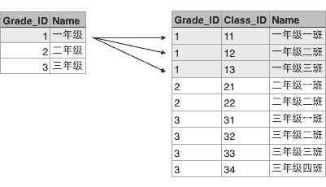
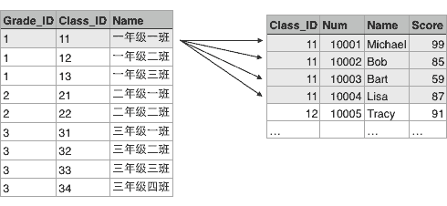

#第20章 访问数据库

程序运行的时候，数据都是在内存中的。当程序终止的时候，通常都需要将数据保存到磁盘上，无论是保存到本地磁盘，还是通过网络保存到服务器上，最终都会将数据写入磁盘文件。

而如何定义数据的存储格式就是一个大问题。如果我们自己来定义存储格式，比如保存一个班级所有学生的成绩单：

|名字	|成绩
|-|-|
|Michael	|99
|Bob	|85
|Bart	|59
|Lisa	|87
你可以用一个文本文件保存，一行保存一个学生，用,隔开：

	Michael,99
	Bob,85
	Bart,59
	Lisa,87
你还可以用JSON格式保存，也是文本文件：

	[
	    {"name":"Michael","score":99},
	    {"name":"Bob","score":85},
	    {"name":"Bart","score":59},
	    {"name":"Lisa","score":87}
	]
你还可以定义各种保存格式，但是问题来了：

存储和读取需要自己实现，JSON还是标准，自己定义的格式就各式各样了；

不能做快速查询，只有把数据全部读到内存中才能自己遍历，但有时候数据的大小远远超过了内存（比如蓝光电影，40GB的数据），根本无法全部读入内存。

为了便于程序保存和读取数据，而且，能直接通过条件快速查询到指定的数据，就出现了数据库（Database）这种专门用于集中存储和查询的软件。

数据库软件诞生的历史非常久远，早在1950年数据库就诞生了。经历了网状数据库，层次数据库，我们现在广泛使用的关系数据库是20世纪70年代基于关系模型的基础上诞生的。

关系模型有一套复杂的数学理论，但是从概念上是十分容易理解的。举个学校的例子：

假设某个XX省YY市ZZ县第一实验小学有3个年级，要表示出这3个年级，可以在Excel中用一个表格画出来：

每个年级又有若干个班级，要把所有班级表示出来，可以在Excel中再画一个表格：

这两个表格有个映射关系，就是根据Grade_ID可以在班级表中查找到对应的所有班级：

也就是Grade表的每一行对应Class表的多行，在关系数据库中，这种基于表（Table）的一对多的关系就是关系数据库的基础。

根据某个年级的ID就可以查找所有班级的行，这种查询语句在关系数据库中称为SQL语句，可以写成：

	SELECT * FROM classes WHERE grade_id = '1';
结果也是一个表：

	---------+----------+----------
	grade_id | class_id | name
	---------+----------+----------
	1        | 11       | 一年级一班
	---------+----------+----------
	1        | 12       | 一年级二班
	---------+----------+----------
	1        | 13       | 一年级三班
	---------+----------+----------
类似的，Class表的一行记录又可以关联到Student表的多行记录：

由于本教程不涉及到关系数据库的详细内容，如果你想从零学习关系数据库和基本的SQL语句，推荐Coursera课程：

英文：https://www.coursera.org/course/db

中文：http://c.open.163.com/coursera/courseIntro.htm?cid=12

##NoSQL

你也许还听说过NoSQL数据库，很多NoSQL宣传其速度和规模远远超过关系数据库，所以很多同学觉得有了NoSQL是否就不需要SQL了呢？千万不要被他们忽悠了，连SQL都不明白怎么可能搞明白NoSQL呢？

##数据库类别

既然我们要使用关系数据库，就必须选择一个关系数据库。目前广泛使用的关系数据库也就这么几种：

付费的商用数据库：

- Oracle，典型的高富帅；

- SQL Server，微软自家产品，Windows定制专款；

- DB2，IBM的产品，听起来挺高端；

- Sybase，曾经跟微软是好基友，后来关系破裂，现在家境惨淡。

这些数据库都是不开源而且付费的，最大的好处是花了钱出了问题可以找厂家解决，不过在Web的世界里，常常需要部署成千上万的数据库服务器，当然不能把大把大把的银子扔给厂家，所以，无论是Google、Facebook，还是国内的BAT，无一例外都选择了免费的开源数据库：

- MySQL，大家都在用，一般错不了；

- PostgreSQL，学术气息有点重，其实挺不错，但知名度没有MySQL高；

- sqlite，嵌入式数据库，适合桌面和移动应用。

作为Python开发工程师，选择哪个免费数据库呢？当然是MySQL。因为MySQL普及率最高，出了错，可以很容易找到解决方法。而且，围绕MySQL有一大堆监控和运维的工具，安装和使用很方便。

为了能继续后面的学习，你需要从MySQL官方网站下载并安装MySQL Community Server 5.6，这个版本是免费的，其他高级版本是要收钱的（请放心，收钱的功能我们用不上）。