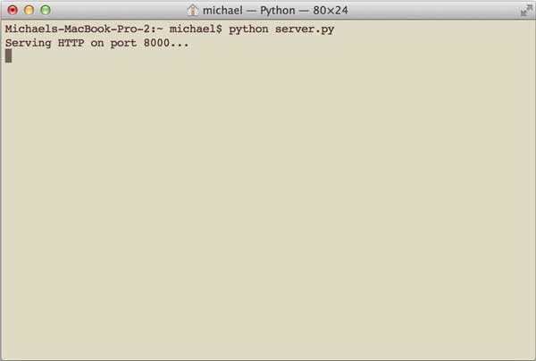
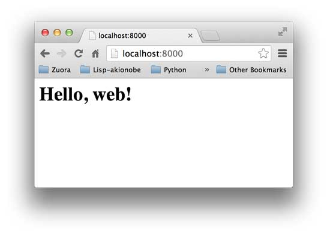
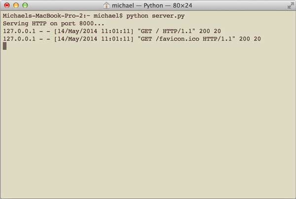
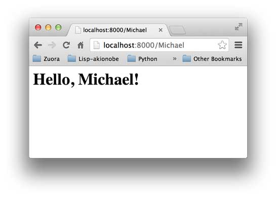

#21-3 WSGI接口

了解了HTTP协议和HTML文档，我们其实就明白了一个Web应用的本质就是：

1. 浏览器发送一个HTTP请求；

2. 服务器收到请求，生成一个HTML文档；

3. 服务器把HTML文档作为HTTP响应的Body发送给浏览器；

4. 浏览器收到HTTP响应，从HTTP Body取出HTML文档并显示。

所以，最简单的Web应用就是先把HTML用文件保存好，用一个现成的HTTP服务器软件，接收用户请求，从文件中读取HTML，返回。Apache、Nginx、Lighttpd等这些常见的静态服务器就是干这件事情的。

如果要动态生成HTML，就需要把上述步骤自己来实现。不过，接受HTTP请求、解析HTTP请求、发送HTTP响应都是苦力活，如果我们自己来写这些底层代码，还没开始写动态HTML呢，就得花个把月去读HTTP规范。

正确的做法是底层代码由专门的服务器软件实现，我们用Python专注于生成HTML文档。因为我们不希望接触到TCP连接、HTTP原始请求和响应格式，所以，需要一个统一的接口，让我们专心用Python编写Web业务。

这个接口就是WSGI：Web Server Gateway Interface。

WSGI接口定义非常简单，它只要求Web开发者实现一个函数，就可以响应HTTP请求。我们来看一个最简单的Web版本的“Hello, web!”：

	def application(environ, start_response):
	    start_response('200 OK', [('Content-Type', 'text/html')])
	    return '<h1>Hello, web!</h1>'
上面的application()函数就是符合WSGI标准的一个HTTP处理函数，它接收两个参数：

- environ：一个包含所有HTTP请求信息的dict对象；

- start_response：一个发送HTTP响应的函数。

在application()函数中，调用：

	start_response('200 OK', [('Content-Type', 'text/html')])
就发送了HTTP响应的Header，注意Header只能发送一次，也就是只能调用一次start_response()函数。start_response()函数接收两个参数，一个是HTTP响应码，一个是一组list表示的HTTP Header，每个Header用一个包含两个str的tuple表示。

通常情况下，都应该把Content-Type头发送给浏览器。其他很多常用的HTTP Header也应该发送。

然后，函数的返回值'<h1>Hello, web!</h1>'将作为HTTP响应的Body发送给浏览器。

有了WSGI，我们关心的就是如何从environ这个dict对象拿到HTTP请求信息，然后构造HTML，通过start_response()发送Header，最后返回Body。

整个application()函数本身没有涉及到任何解析HTTP的部分，也就是说，底层代码不需要我们自己编写，我们只负责在更高层次上考虑如何响应请求就可以了。

不过，等等，这个application()函数怎么调用？如果我们自己调用，两个参数environ和start_response我们没法提供，返回的str也没法发给浏览器。

所以application()函数必须由WSGI服务器来调用。有很多符合WSGI规范的服务器，我们可以挑选一个来用。但是现在，我们只想尽快测试一下我们编写的application()函数真的可以把HTML输出到浏览器，所以，要赶紧找一个最简单的WSGI服务器，把我们的Web应用程序跑起来。

好消息是Python内置了一个WSGI服务器，这个模块叫wsgiref，它是用纯Python编写的WSGI服务器的参考实现。所谓“参考实现”是指该实现完全符合WSGI标准，但是不考虑任何运行效率，仅供开发和测试使用。

##运行WSGI服务

我们先编写hello.py，实现Web应用程序的WSGI处理函数：

	# hello.py
	
	def application(environ, start_response):
	    start_response('200 OK', [('Content-Type', 'text/html')])
	    return '<h1>Hello, web!</h1>'
然后，再编写一个server.py，负责启动WSGI服务器，加载application()函数：

	# server.py
	# 从wsgiref模块导入:
	from wsgiref.simple_server import make_server
	# 导入我们自己编写的application函数:
	from hello import application
	
	# 创建一个服务器，IP地址为空，端口是8000，处理函数是application:
	httpd = make_server('', 8000, application)
	print "Serving HTTP on port 8000..."
	# 开始监听HTTP请求:
	httpd.serve_forever()
确保以上两个文件在同一个目录下，然后在命令行输入python server.py来启动WSGI服务器：

注意：如果8000端口已被其他程序占用，启动将失败，请修改成其他端口。

启动成功后，打开浏览器，输入http://localhost:8000/，就可以看到结果了：

在命令行可以看到wsgiref打印的log信息：

按Ctrl+C终止服务器。

如果你觉得这个Web应用太简单了，可以稍微改造一下，从environ里读取PATH_INFO，这样可以显示更加动态的内容：

	# hello.py
	
	def application(environ, start_response):
	    start_response('200 OK', [('Content-Type', 'text/html')])
	    return '<h1>Hello, %s!</h1>' % (environ['PATH_INFO'][1:] or 'web')
你可以在地址栏输入用户名作为URL的一部分，将返回Hello, xxx!：

是不是有点Web App的感觉了？

##小结

无论多么复杂的Web应用程序，入口都是一个WSGI处理函数。HTTP请求的所有输入信息都可以通过environ获得，HTTP响应的输出都可以通过start_response()加上函数返回值作为Body。

复杂的Web应用程序，光靠一个WSGI函数来处理还是太底层了，我们需要在WSGI之上再抽象出Web框架，进一步简化Web开发。