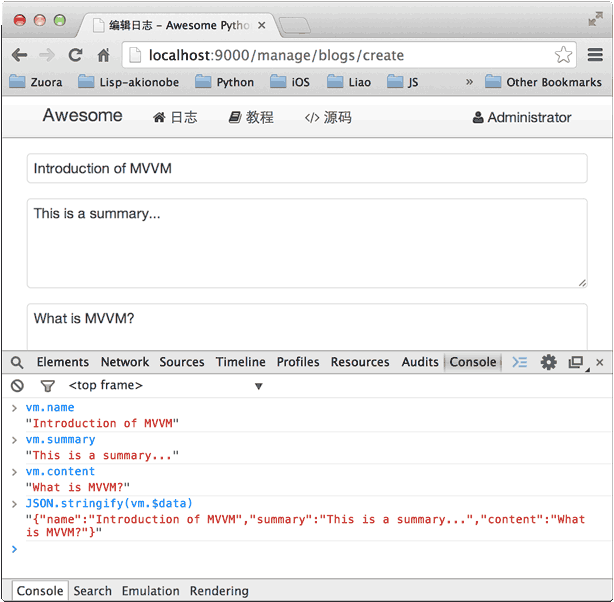
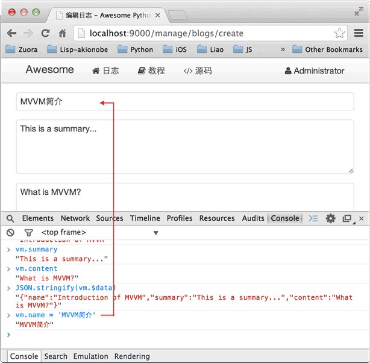

#23-11 Day 11 - 编写日志创建页

在Web开发中，后端代码写起来其实是相当容易的。

例如，我们编写一个REST API，用于创建一个Blog：

	@api
	@post('/api/blogs')
	def api_create_blog():
	    i = ctx.request.input(name='', summary='', content='')
	    name = i.name.strip()
	    summary = i.summary.strip()
	    content = i.content.strip()
	    if not name:
	        raise APIValueError('name', 'name cannot be empty.')
	    if not summary:
	        raise APIValueError('summary', 'summary cannot be empty.')
	    if not content:
	        raise APIValueError('content', 'content cannot be empty.')
	    user = ctx.request.user
	    blog = Blog(user_id=user.id, user_name=user.name, name=name, summary=summary, content=content)
	    blog.insert()
	    return blog
编写后端Python代码不但很简单，而且非常容易测试，上面的API：api_create_blog()本身只是一个普通函数。

Web开发真正困难的地方在于编写前端页面。前端页面需要混合HTML、CSS和JavaScript，如果对这三者没有深入地掌握，编写的前端页面将很快难以维护。

更大的问题在于，前端页面通常是动态页面，也就是说，前端页面往往是由后端代码生成的。

生成前端页面最早的方式是拼接字符串：

	s = '<html><head><title>'
	  + title
	  + '</title></head><body>'
	  + body
	  + '</body></html>'
显然这种方式完全不具备可维护性。所以有第二种模板方式：

	<html>
	<head>
	    <title>{{ title }}</title>
	</head>
	<body>
	    {{ body }}
	</body>
	</html>
ASP、JSP、PHP等都是用这种模板方式生成前端页面。

如果在页面上大量使用JavaScript（事实上大部分页面都会），模板方式仍然会导致JavaScript代码与后端代码绑得非常紧密，以至于难以维护。其根本原因在于负责显示的HTML DOM模型与负责数据和交互的JavaScript代码没有分割清楚。

要编写可维护的前端代码绝非易事。和后端结合的MVC模式已经无法满足复杂页面逻辑的需要了，所以，新的MVVM：Model View ViewModel模式应运而生。

MVVM最早由微软提出来，它借鉴了桌面应用程序的MVC思想，在前端页面中，把Model用纯JavaScript对象表示：

	
View是纯HTML：

	<form action="/api/blogs" method="post">
	    <input name="name">
	    <input name="summary">
	    <textarea name="content"></textarea>
	    <button type="submit">OK</button>
	</form>
由于Model表示数据，View负责显示，两者做到了最大限度的分离。

把Model和View关联起来的就是ViewModel。ViewModel负责把Model的数据同步到View显示出来，还负责把View的修改同步回Model。

ViewModel如何编写？需要用JavaScript编写一个通用的ViewModel，这样，就可以复用整个MVVM模型了。

好消息是已有许多成熟的MVVM框架，例如AngularJS，KnockoutJS等。我们选择Vue这个简单易用的MVVM框架来实现创建Blog的页面templates/manage_blog_edit.html：

	{％ extends '__base__.html' ％}
	
	编辑日志
	
	
	
	
	
	
	
	

	    <form id="form-blog" v-on="submit: submit" class="uk-form uk-form-stacked">
	        

	            

	                <input v-model="name" class="uk-width-1-1">
	            

	        

	        

	            

	                <textarea v-model="summary" rows="4" class="uk-width-1-1"></textarea>
	            

	        

	        

	            

	                <textarea v-model="content" rows="8" class="uk-width-1-1"></textarea>
	            

	        

	        

	            <button type="submit" class="uk-button uk-button-primary">保存</button>
	        

	    </form>
	

	
初始化Vue时，我们指定3个参数：

- el：根据选择器查找绑定的View，这里是#form-blog，就是id为form-blog的DOM，对应的是一个`<form>`标签；

- data：JavaScript对象表示的Model，我们初始化为{ name: '', summary: '', content: ''}；

- methods：View可以触发的JavaScript函数，submit就是提交表单时触发的函数。

接下来，我们在<form>标签中，用几个简单的v-model，就可以让Vue把Model和View关联起来：

	<!-- input的value和Model的name关联起来了 -->
	<input v-model="name" class="uk-width-1-1">
Form表单通过<form v-on="submit: submit">把提交表单的事件关联到submit方法。

需要特别注意的是，在MVVM中，Model和View是双向绑定的。如果我们在Form中修改了文本框的值，可以在Model中立刻拿到新的值。试试在表单中输入文本，然后在Chrome浏览器中打开JavaScript控制台，可以通过vm.name访问单个属性，或者通过vm.$data访问整个Model：

如果我们在JavaScript逻辑中修改了Model，这个修改会立刻反映到View上。试试在JavaScript控制台输入vm.name = 'MVVM简介'，可以看到文本框的内容自动被同步了：

双向绑定是MVVM框架最大的作用。借助于MVVM，我们把复杂的显示逻辑交给框架完成。由于后端编写了独立的REST API，所以，前端用AJAX提交表单非常容易，前后端分离得非常彻底。