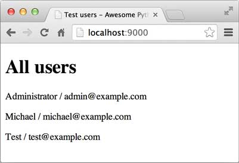

#23-7 Day 7 - 编写MVC

现在，ORM框架、Web框架和配置都已就绪，我们可以开始编写一个最简单的MVC，把它们全部启动起来。

通过Web框架的@decorator和ORM框架的Model支持，可以很容易地编写一个处理首页URL的函数：

	# urls.py
	from transwarp.web import get, view
	from models import User, Blog, Comment
	
	@view('test_users.html')
	@get('/')
	def test_users():
	    users = User.find_all()
	    return dict(users=users)
@view指定的模板文件是test_users.html，所以我们在模板的根目录templates下创建test_users.html：

	<!DOCTYPE html>
	<html>
	<head>
	    <meta charset="utf-8" />
	    <title>Test users - Awesome Python Webapp</title>
	</head>
	<body>
	    <h1>All users</h1>
	    
	    
{{ u.name }} / {{ u.email }}

	    
	</body>
	</html>
接下来，我们创建一个Web App的启动文件wsgiapp.py，负责初始化数据库、初始化Web框架，然后加载urls.py，最后启动Web服务：

	# wsgiapp.py
	import logging; logging.basicConfig(level=logging.INFO)
	import os
	
	from transwarp import db
	from transwarp.web import WSGIApplication, Jinja2TemplateEngine
	
	from config import configs
	
	# 初始化数据库:
	db.create_engine(**configs.db)
	
	# 创建一个WSGIApplication:
	wsgi = WSGIApplication(os.path.dirname(os.path.abspath(__file__)))
	# 初始化jinja2模板引擎:
	template_engine = Jinja2TemplateEngine(os.path.join(os.path.dirname(os.path.abspath(__file__)), 'templates'))
	wsgi.template_engine = template_engine
	
	# 加载带有@get/@post的URL处理函数:
	import urls
	wsgi.add_module(urls)
	
	# 在9000端口上启动本地测试服务器:
	if __name__ == '__main__':
	    wsgi.run(9000)
如果一切顺利，可以用命令行启动Web服务器：

	$ python wsgiapp.py
然后，在浏览器中访问http://localhost:9000/。

如果数据库的users表什么内容也没有，你就无法在浏览器中看到循环输出的内容。可以自己在MySQL的命令行里给users表添加几条记录，然后再访问：

