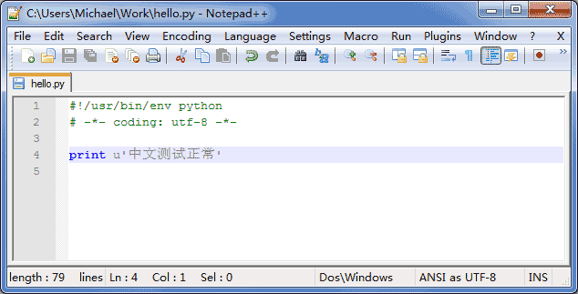
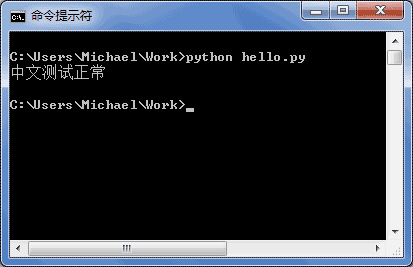

#4-2 字符串和编码

##字符编码

我们已经讲过了，字符串也是一种数据类型，但是，字符串比较特殊的是还有一个编码问题。

因为计算机只能处理数字，如果要处理文本，就必须先把文本转换为数字才能处理。最早的计算机在设计时采用8个比特（bit）作为一个字节（byte），所以，一个字节能表示的最大的整数就是255（二进制11111111=十进制255），如果要表示更大的整数，就必须用更多的字节。比如两个字节可以表示的最大整数是65535，4个字节可以表示的最大整数是4294967295。

由于计算机是美国人发明的，因此，最早只有127个字母被编码到计算机里，也就是大小写英文字母、数字和一些符号，这个编码表被称为ASCII编码，比如大写字母A的编码是65，小写字母z的编码是122。

但是要处理中文显然一个字节是不够的，至少需要两个字节，而且还不能和ASCII编码冲突，所以，中国制定了GB2312编码，用来把中文编进去。

你可以想得到的是，全世界有上百种语言，日本把日文编到Shift_JIS里，韩国把韩文编到Euc-kr里，各国有各国的标准，就会不可避免地出现冲突，结果就是，在多语言混合的文本中，显示出来会有乱码。

因此，Unicode应运而生。Unicode把所有语言都统一到一套编码里，这样就不会再有乱码问题了。

Unicode标准也在不断发展，但最常用的是用两个字节表示一个字符（如果要用到非常偏僻的字符，就需要4个字节）。现代操作系统和大多数编程语言都直接支持Unicode。

现在，捋一捋ASCII编码和Unicode编码的区别：ASCII编码是1个字节，而Unicode编码通常是2个字节。

字母A用ASCII编码是十进制的65，二进制的01000001；

字符0用ASCII编码是十进制的48，二进制的00110000，注意字符'0'和整数0是不同的；

汉字中已经超出了ASCII编码的范围，用Unicode编码是十进制的20013，二进制的01001110 00101101。

你可以猜测，如果把ASCII编码的A用Unicode编码，只需要在前面补0就可以，因此，A的Unicode编码是00000000 01000001。

新的问题又出现了：如果统一成Unicode编码，乱码问题从此消失了。但是，如果你写的文本基本上全部是英文的话，用Unicode编码比ASCII编码需要多一倍的存储空间，在存储和传输上就十分不划算。

所以，本着节约的精神，又出现了把Unicode编码转化为“可变长编码”的UTF-8编码。UTF-8编码把一个Unicode字符根据不同的数字大小编码成1-6个字节，常用的英文字母被编码成1个字节，汉字通常是3个字节，只有很生僻的字符才会被编码成4-6个字节。如果你要传输的文本包含大量英文字符，用UTF-8编码就能节省空间：

|字符	|ASCII	|Unicode	|UTF-8
|-|-|-|-
|A	|01000001	|00000000 01000001	|01000001
|中	|x	|01001110 00101101	|11100100 10111000 10101101
从上面的表格还可以发现，UTF-8编码有一个额外的好处，就是ASCII编码实际上可以被看成是UTF-8编码的一部分，所以，大量只支持ASCII编码的历史遗留软件可以在UTF-8编码下继续工作。

搞清楚了ASCII、Unicode和UTF-8的关系，我们就可以总结一下现在计算机系统通用的字符编码工作方式：

在计算机内存中，统一使用Unicode编码，当需要保存到硬盘或者需要传输的时候，就转换为UTF-8编码。

用记事本编辑的时候，从文件读取的UTF-8字符被转换为Unicode字符到内存里，编辑完成后，保存的时候再把Unicode转换为UTF-8保存到文件：

浏览网页的时候，服务器会把动态生成的Unicode内容转换为UTF-8再传输到浏览器：

所以你看到很多网页的源码上会有类似`<meta charset="UTF-8" />`的信息，表示该网页正是用的UTF-8编码。

##Python的字符串

搞清楚了令人头疼的字符编码问题后，我们再来研究Python对Unicode的支持。

因为Python的诞生比Unicode标准发布的时间还要早，所以最早的Python只支持ASCII编码，普通的字符串'ABC'在Python内部都是ASCII编码的。Python提供了ord()和chr()函数，可以把字母和对应的数字相互转换：

	>>> ord('A')
	65
	>>> chr(65)
	'A'
Python在后来添加了对Unicode的支持，以Unicode表示的字符串用u'...'表示，比如：

	>>> print u'中文'
	中文
	>>> u'中'
	u'\u4e2d'
写u'中'和u'\u4e2d'是一样的，\u后面是十六进制的Unicode码。因此，u'A'和u'\u0041'也是一样的。

两种字符串如何相互转换？字符串'xxx'虽然是ASCII编码，但也可以看成是UTF-8编码，而u'xxx'则只能是Unicode编码。

把u'xxx'转换为UTF-8编码的'xxx'用encode('utf-8')方法：

	>>> u'ABC'.encode('utf-8')
	'ABC'
	>>> u'中文'.encode('utf-8')
	'\xe4\xb8\xad\xe6\x96\x87'
英文字符转换后表示的UTF-8的值和Unicode值相等（但占用的存储空间不同），而中文字符转换后1个Unicode字符将变为3个UTF-8字符，你看到的\xe4就是其中一个字节，因为它的值是228，没有对应的字母可以显示，所以以十六进制显示字节的数值。len()函数可以返回字符串的长度：

	>>> len(u'ABC')
	3
	>>> len('ABC')
	3
	>>> len(u'中文')
	2
	>>> len('\xe4\xb8\xad\xe6\x96\x87')
	6
反过来，把UTF-8编码表示的字符串'xxx'转换为Unicode字符串u'xxx'用decode('utf-8')方法：

	>>> 'abc'.decode('utf-8')
	u'abc'
	>>> '\xe4\xb8\xad\xe6\x96\x87'.decode('utf-8')
	u'\u4e2d\u6587'
	>>> print '\xe4\xb8\xad\xe6\x96\x87'.decode('utf-8')
	中文
由于Python源代码也是一个文本文件，所以，当你的源代码中包含中文的时候，在保存源代码时，就需要务必指定保存为UTF-8编码。当Python解释器读取源代码时，为了让它按UTF-8编码读取，我们通常在文件开头写上这两行：

	#!/usr/bin/env python
	# -*- coding: utf-8 -*-
第一行注释是为了告诉Linux/OS X系统，这是一个Python可执行程序，Windows系统会忽略这个注释；

第二行注释是为了告诉Python解释器，按照UTF-8编码读取源代码，否则，你在源代码中写的中文输出可能会有乱码。

如果你使用Notepad++进行编辑，除了要加上`# -*- coding: utf-8 -*-`外，中文字符串必须是Unicode字符串：

申明了UTF-8编码并不意味着你的.py文件就是UTF-8编码的，必须并且要确保Notepad++正在使用UTF-8 without BOM编码：

如果.py文件本身使用UTF-8编码，并且也申明了`# -*- coding: utf-8 -*-`，打开命令提示符测试就可以正常显示中文：

##格式化

最后一个常见的问题是如何输出格式化的字符串。我们经常会输出类似'亲爱的xxx你好！你xx月的话费是xx，余额是xx'之类的字符串，而xxx的内容都是根据变量变化的，所以，需要一种简便的格式化字符串的方式。

在Python中，采用的格式化方式和C语言是一致的，用%实现，举例如下：

	>>> 'Hello, %s' % 'world'
	'Hello, world'
	>>> 'Hi, %s, you have $%d.' % ('Michael', 1000000)
	'Hi, Michael, you have $1000000.'
你可能猜到了，%运算符就是用来格式化字符串的。在字符串内部，%s表示用字符串替换，%d表示用整数替换，有几个%?占位符，后面就跟几个变量或者值，顺序要对应好。如果只有一个%?，括号可以省略。

常见的占位符有：

	%d	整数
	%f	浮点数
	%s	字符串
	%x	十六进制整数
其中，格式化整数和浮点数还可以指定是否补0和整数与小数的位数：

	>>> '%2d-%02d' % (3, 1)
	' 3-01'
	>>> '%.2f' % 3.1415926
	'3.14'
如果你不太确定应该用什么，%s永远起作用，它会把任何数据类型转换为字符串：

	>>> 'Age: %s. Gender: %s' % (25, True)
	'Age: 25. Gender: True'
对于Unicode字符串，用法完全一样，但最好确保替换的字符串也是Unicode字符串：

	>>> u'Hi, %s' % u'Michael'
	u'Hi, Michael'
有些时候，字符串里面的%是一个普通字符怎么办？这个时候就需要转义，用%%来表示一个%：

	>>> 'growth rate: %d %%' % 7
	'growth rate: 7 %'
##小结

由于历史遗留问题，Python 2.x版本虽然支持Unicode，但在语法上需要'xxx'和u'xxx'两种字符串表示方式。

Python当然也支持其他编码方式，比如把Unicode编码成GB2312：

	>>> u'中文'.encode('gb2312')
	'\xd6\xd0\xce\xc4'
但这种方式纯属自找麻烦，如果没有特殊业务要求，请牢记仅使用Unicode和UTF-8这两种编码方式。

在Python 3.x版本中，把'xxx'和u'xxx'统一成Unicode编码，即写不写前缀u都是一样的，而以字节形式表示的字符串则必须加上b前缀：b'xxx'。

格式化字符串的时候，可以用Python的交互式命令行测试，方便快捷。