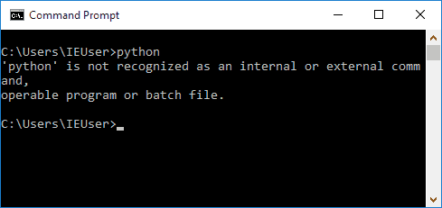

#第2章 安装Python

因为Python是跨平台的，它可以运行在Windows、Mac和各种Linux/Unix系统上。在Windows上写Python程序，放到Linux上也是能够运行的。

要开始学习Python编程，首先就得把Python安装到你的电脑里。安装后，你会得到Python解释器（就是负责运行Python程序的），一个命令行交互环境，还有一个简单的集成开发环境。

##安装Python 3.5

目前，Python有两个版本，一个是2.x版，一个是3.x版，这两个版本是不兼容的。由于3.x版越来越普及，我们的教程将以最新的Python 3.5版本为基础。请确保你的电脑上安装的Python版本是最新的3.5.x，这样，你才能无痛学习这个教程。

##在Mac上安装Python

如果你正在使用Mac，系统是OS X 10.8~10.10，那么系统自带的Python版本是2.7。要安装最新的Python 3.5，有两个方法：

方法一：从Python官网下载Python 3.5的安装程序（网速慢的同学请移步国内镜像），双击运行并安装；

方法二：如果安装了Homebrew，直接通过命令brew install python3安装即可。

##在Linux上安装Python

如果你正在使用Linux，那我可以假定你有Linux系统管理经验，自行安装Python 3应该没有问题，否则，请换回Windows系统。

对于大量的目前仍在使用Windows的同学，如果短期内没有打算换Mac，就可以继续阅读以下内容。

##在Windows上安装Python

首先，根据你的Windows版本（64位还是32位）从Python的官方网站下载Python 3.5对应的64位安装程序或32位安装程序（网速慢的同学请移步国内镜像），然后，运行下载的EXE安装包：

[install-py35](../image/chapter2/2-1.jpg)

特别要注意勾上Add Python 3.5 to PATH，然后点“Install Now”即可完成安装。

视频演示：

[install-py.mp4](http://asklxf.coding.me/liaoxuefeng/v/python/install-py.mp4)

<video width="100%" controls="">
<source src="../video/chapter2/install-py.mp4">
</video>

##运行Python

安装成功后，打开命令提示符窗口，敲入python后，会出现两种情况：

情况一：

看到上面的画面，就说明Python安装成功！

你看到提示符>>>就表示我们已经在Python交互式环境中了，可以输入任何Python代码，回车后会立刻得到执行结果。现在，输入exit()并回车，就可以退出Python交互式环境（直接关掉命令行窗口也可以）。

情况二：得到一个错误：

	‘python’ 不是内部或外部命令，也不是可运行的程序或批处理文件。

这是因为Windows会根据一个Path的环境变量设定的路径去查找python.exe，如果没找到，就会报错。如果在安装时漏掉了勾选Add Python 3.5 to PATH，那就要手动把python.exe所在的路径添加到Path中。

如果你不知道怎么修改环境变量，建议把Python安装程序重新运行一遍，务必记得勾上Add Python 3.5 to PATH。

视频演示：

[start-py.mp4](http://asklxf.coding.me/liaoxuefeng/v/python/start-py.mp4)

<video width="100%" controls="">
<source src="../video/chapter2/start-py.mp4">
</video>

##小结

学会如何把Python安装到计算机中，并且熟练打开和退出Python交互式环境。

在Windows上运行Python时，请先启动命令行，然后运行python。

在Mac和Linux上运行Python时，请打开终端，然后运行python3。