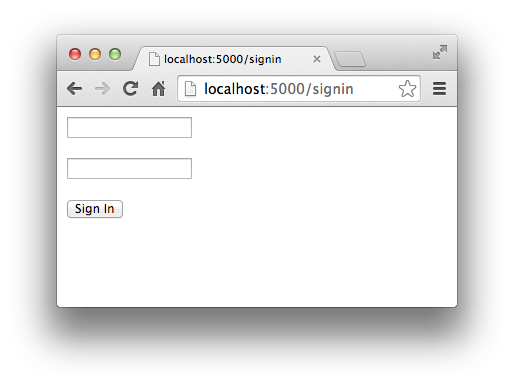
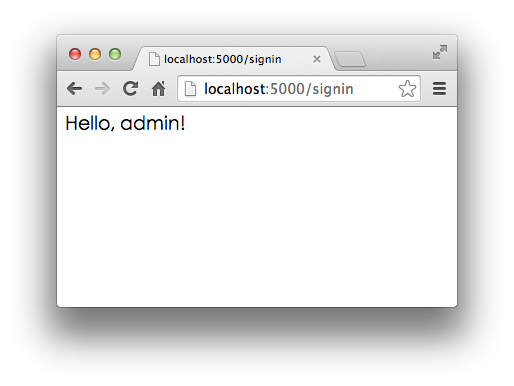

#22-4 使用Web框架

了解了WSGI框架，我们发现：其实一个Web App，就是写一个WSGI的处理函数，针对每个HTTP请求进行响应。

但是如何处理HTTP请求不是问题，问题是如何处理100个不同的URL。

每一个URL可以对应GET和POST请求，当然还有PUT、DELETE等请求，但是我们通常只考虑最常见的GET和POST请求。

一个最简单的想法是从environ变量里取出HTTP请求的信息，然后逐个判断：

	def application(environ, start_response):
	    method = environ['REQUEST_METHOD']
	    path = environ['PATH_INFO']
	    if method=='GET' and path=='/':
	        return handle_home(environ, start_response)
	    if method=='POST' and path='/signin':
	        return handle_signin(environ, start_response)
	    ...
只是这么写下去代码是肯定没法维护了。

代码这么写没法维护的原因是因为WSGI提供的接口虽然比HTTP接口高级了不少，但和Web App的处理逻辑比，还是比较低级，我们需要在WSGI接口之上能进一步抽象，让我们专注于用一个函数处理一个URL，至于URL到函数的映射，就交给Web框架来做。

由于用Python开发一个Web框架十分容易，所以Python有上百个开源的Web框架。这里我们先不讨论各种Web框架的优缺点，直接选择一个比较流行的Web框架——Flask来使用。

用Flask编写Web App比WSGI接口简单（这不是废话么，要是比WSGI还复杂，用框架干嘛？），我们先用easy_install或者pip安装Flask：

	$ easy_install flask
然后写一个app.py，处理3个URL，分别是：

- GET /：首页，返回Home；

- GET /signin：登录页，显示登录表单；

- POST /signin：处理登录表单，显示登录结果。

注意噢，同一个URL/signin分别有GET和POST两种请求，映射到两个处理函数中。

Flask通过Python的装饰器在内部自动地把URL和函数给关联起来，所以，我们写出来的代码就像这样：

	from flask import Flask
	from flask import request
	
	app = Flask(__name__)
	
	@app.route('/', methods=['GET', 'POST'])
	def home():
	    return '<h1>Home</h1>'
	
	@app.route('/signin', methods=['GET'])
	def signin_form():
	    return '''<form action="/signin" method="post">
	              
<input name="username">

	              
<input name="password" type="password">

	              
<button type="submit">Sign In</button>

	              </form>'''
	
	@app.route('/signin', methods=['POST'])
	def signin():
	    # 需要从request对象读取表单内容：
	    if request.form['username']=='admin' and request.form['password']=='password':
	        return '<h3>Hello, admin!</h3>'
	    return '<h3>Bad username or password.</h3>'
	
	if __name__ == '__main__':
	    app.run()
运行python app.py，Flask自带的Server在端口5000上监听：

	$ python app.py 
	 * Running on http://127.0.0.1:5000/
打开浏览器，输入首页地址http://localhost:5000/：

首页显示正确！

再在浏览器地址栏输入http://localhost:5000/signin，会显示登录表单：

输入预设的用户名admin和口令password，登录成功：

输入其他错误的用户名和口令，登录失败：

实际的Web App应该拿到用户名和口令后，去数据库查询再比对，来判断用户是否能登录成功。

除了Flask，常见的Python Web框架还有：

- [Django](https://www.djangoproject.com/)：全能型Web框架；

- [web.py](http://webpy.org/)：一个小巧的Web框架；

- [Bottle](http://bottlepy.org/)：和Flask类似的Web框架；

- [Tornado](http://www.tornadoweb.org/)：Facebook的开源异步Web框架。

当然了，因为开发Python的Web框架也不是什么难事，我们后面也会自己开发一个Web框架。

##小结

有了Web框架，我们在编写Web应用时，注意力就从WSGI处理函数转移到URL+对应的处理函数，这样，编写Web App就更加简单了。

在编写URL处理函数时，除了配置URL外，从HTTP请求拿到用户数据也是非常重要的。Web框架都提供了自己的API来实现这些功能。Flask通过request.form['name']来获取表单的内容。

##参考源码

- 本地

[do_flask.py](../code/chapter22/22-4-do_flask.py)

- github

[do_flask.py](https://github.com/michaelliao/learn-python3/blob/master/samples/web/do_flask.py)