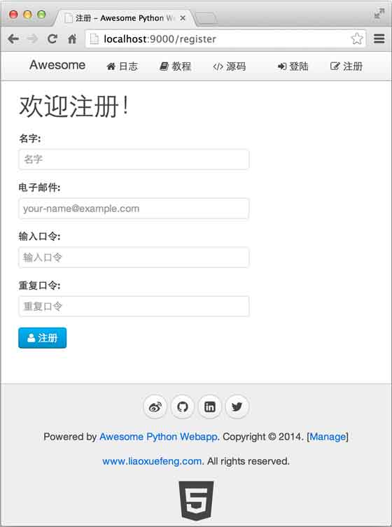

#24-10 Day 10 - 用户注册和登录

用户管理是绝大部分Web网站都需要解决的问题。用户管理涉及到用户注册和登录。

用户注册相对简单，我们可以先通过API把用户注册这个功能实现了：

	_RE_EMAIL = re.compile(r'^[a-z0-9\.\-\_]+\@[a-z0-9\-\_]+(\.[a-z0-9\-\_]+){1,4}$')
	_RE_SHA1 = re.compile(r'^[0-9a-f]{40}$')
	
	@post('/api/users')
	def api_register_user(*, email, name, passwd):
	    if not name or not name.strip():
	        raise APIValueError('name')
	    if not email or not _RE_EMAIL.match(email):
	        raise APIValueError('email')
	    if not passwd or not _RE_SHA1.match(passwd):
	        raise APIValueError('passwd')
	    users = yield from User.findAll('email=?', [email])
	    if len(users) > 0:
	        raise APIError('register:failed', 'email', 'Email is already in use.')
	    uid = next_id()
	    sha1_passwd = '%s:%s' % (uid, passwd)
	    user = User(id=uid, name=name.strip(), email=email, passwd=hashlib.sha1(sha1_passwd.encode('utf-8')).hexdigest(), image='http://www.gravatar.com/avatar/%s?d=mm&s=120' % hashlib.md5(email.encode('utf-8')).hexdigest())
	    yield from user.save()
	    # make session cookie:
	    r = web.Response()
	    r.set_cookie(COOKIE_NAME, user2cookie(user, 86400), max_age=86400, httponly=True)
	    user.passwd = '******'
	    r.content_type = 'application/json'
	    r.body = json.dumps(user, ensure_ascii=False).encode('utf-8')
	    return r
注意用户口令是客户端传递的经过SHA1计算后的40位Hash字符串，所以服务器端并不知道用户的原始口令。

接下来可以创建一个注册页面，让用户填写注册表单，然后，提交数据到注册用户的API：

	{％ extends '__base__.html' ％}
	
	注册
	
	
	
	
	
	
	
	
	
	    

	        <h1>欢迎注册！</h1>
	        <form id="vm" v-on="submit: submit" class="uk-form uk-form-stacked">
	            

	            

	                <label class="uk-form-label">名字:</label>
	                

	                    <input v-model="name" type="text" maxlength="50" placeholder="名字" class="uk-width-1-1">
	                

	            

	            

	                <label class="uk-form-label">电子邮件:</label>
	                

	                    <input v-model="email" type="text" maxlength="50" placeholder="your-name@example.com" class="uk-width-1-1">
	                

	            

	            

	                <label class="uk-form-label">输入口令:</label>
	                

	                    <input v-model="password1" type="password" maxlength="50" placeholder="输入口令" class="uk-width-1-1">
	                

	            

	            

	                <label class="uk-form-label">重复口令:</label>
	                

	                    <input v-model="password2" type="password" maxlength="50" placeholder="重复口令" class="uk-width-1-1">
	                

	            

	            

	                <button type="submit" class="uk-button uk-button-primary"><i class="uk-icon-user"></i> 注册</button>
	            

	        </form>
	    

	
	
这样我们就把用户注册的功能完成了：

用户登录比用户注册复杂。由于HTTP协议是一种无状态协议，而服务器要跟踪用户状态，就只能通过cookie实现。大多数Web框架提供了Session功能来封装保存用户状态的cookie。

Session的优点是简单易用，可以直接从Session中取出用户登录信息。

Session的缺点是服务器需要在内存中维护一个映射表来存储用户登录信息，如果有两台以上服务器，就需要对Session做集群，因此，使用Session的Web App很难扩展。

我们采用直接读取cookie的方式来验证用户登录，每次用户访问任意URL，都会对cookie进行验证，这种方式的好处是保证服务器处理任意的URL都是无状态的，可以扩展到多台服务器。

由于登录成功后是由服务器生成一个cookie发送给浏览器，所以，要保证这个cookie不会被客户端伪造出来。

实现防伪造cookie的关键是通过一个单向算法（例如SHA1），举例如下：

当用户输入了正确的口令登录成功后，服务器可以从数据库取到用户的id，并按照如下方式计算出一个字符串：

	"用户id" + "过期时间" + SHA1("用户id" + "用户口令" + "过期时间" + "SecretKey")
当浏览器发送cookie到服务器端后，服务器可以拿到的信息包括：

- 用户id

- 过期时间

- SHA1值

如果未到过期时间，服务器就根据用户id查找用户口令，并计算：

SHA1("用户id" + "用户口令" + "过期时间" + "SecretKey")
并与浏览器cookie中的MD5进行比较，如果相等，则说明用户已登录，否则，cookie就是伪造的。

这个算法的关键在于SHA1是一种单向算法，即可以通过原始字符串计算出SHA1结果，但无法通过SHA1结果反推出原始字符串。

所以登录API可以实现如下：

	@post('/api/authenticate')
	def authenticate(*, email, passwd):
	    if not email:
	        raise APIValueError('email', 'Invalid email.')
	    if not passwd:
	        raise APIValueError('passwd', 'Invalid password.')
	    users = yield from User.findAll('email=?', [email])
	    if len(users) == 0:
	        raise APIValueError('email', 'Email not exist.')
	    user = users[0]
	    # check passwd:
	    sha1 = hashlib.sha1()
	    sha1.update(user.id.encode('utf-8'))
	    sha1.update(b':')
	    sha1.update(passwd.encode('utf-8'))
	    if user.passwd != sha1.hexdigest():
	        raise APIValueError('passwd', 'Invalid password.')
	    # authenticate ok, set cookie:
	    r = web.Response()
	    r.set_cookie(COOKIE_NAME, user2cookie(user, 86400), max_age=86400, httponly=True)
	    user.passwd = '******'
	    r.content_type = 'application/json'
	    r.body = json.dumps(user, ensure_ascii=False).encode('utf-8')
	    return r
	
	# 计算加密cookie:
	def user2cookie(user, max_age):
	    # build cookie string by: id-expires-sha1
	    expires = str(int(time.time() + max_age))
	    s = '%s-%s-%s-%s' % (user.id, user.passwd, expires, _COOKIE_KEY)
	    L = [user.id, expires, hashlib.sha1(s.encode('utf-8')).hexdigest()]
	    return '-'.join(L)
对于每个URL处理函数，如果我们都去写解析cookie的代码，那会导致代码重复很多次。

利用middle在处理URL之前，把cookie解析出来，并将登录用户绑定到request对象上，这样，后续的URL处理函数就可以直接拿到登录用户：

	@asyncio.coroutine
	def auth_factory(app, handler):
	    @asyncio.coroutine
	    def auth(request):
	        logging.info('check user: %s %s' % (request.method, request.path))
	        request.__user__ = None
	        cookie_str = request.cookies.get(COOKIE_NAME)
	        if cookie_str:
	            user = yield from cookie2user(cookie_str)
	            if user:
	                logging.info('set current user: %s' % user.email)
	                request.__user__ = user
	        return (yield from handler(request))
	    return auth
	
	# 解密cookie:
	@asyncio.coroutine
	def cookie2user(cookie_str):
	    '''
	    Parse cookie and load user if cookie is valid.
	    '''
	    if not cookie_str:
	        return None
	    try:
	        L = cookie_str.split('-')
	        if len(L) != 3:
	            return None
	        uid, expires, sha1 = L
	        if int(expires) < time.time():
	            return None
	        user = yield from User.find(uid)
	        if user is None:
	            return None
	        s = '%s-%s-%s-%s' % (uid, user.passwd, expires, _COOKIE_KEY)
	        if sha1 != hashlib.sha1(s.encode('utf-8')).hexdigest():
	            logging.info('invalid sha1')
	            return None
	        user.passwd = '******'
	        return user
	    except Exception as e:
	        logging.exception(e)
	        return None
这样，我们就完成了用户注册和登录的功能。

##参考源码

[day-10](https://github.com/michaelliao/awesome-python3-webapp/tree/day-10)