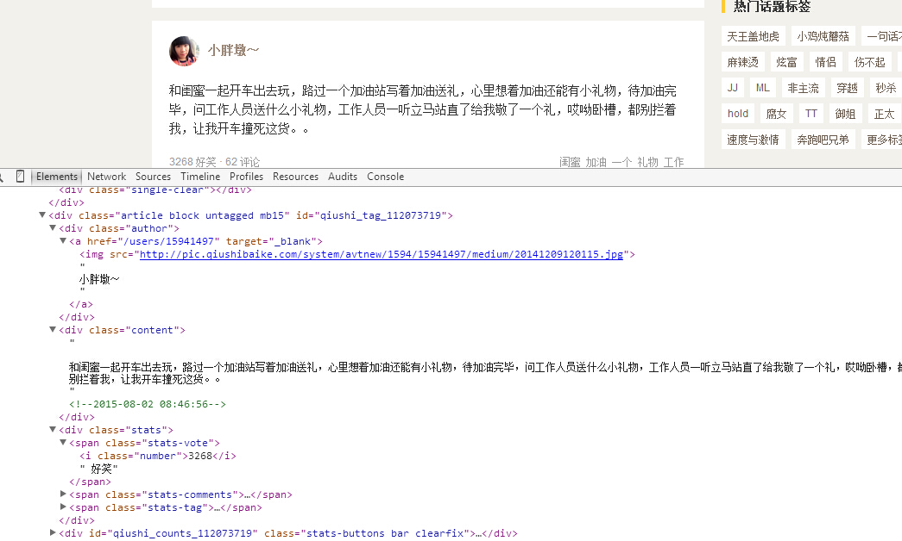
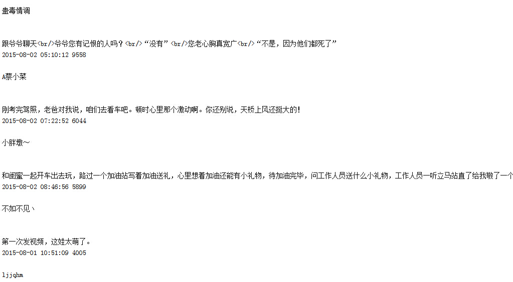

# Python爬虫实战一之爬取糗事百科段子

大家好，前面入门已经说了那么多基础知识了，下面我们做几个实战项目来挑战一下吧。那么这次为大家带来，Python爬取糗事百科的小段子的例子。

首先，糗事百科大家都听说过吧？糗友们发的搞笑的段子一抓一大把，这次我们尝试一下用爬虫把他们抓取下来。

## 友情提示

> 糗事百科在前一段时间进行了改版，导致之前的代码没法用了，会导致无法输出和CPU占用过高的情况，是因为正则表达式没有匹配到的缘故。
现在，博主已经对程序进行了重新修改，代码亲测可用，包括截图和说明，之前一直在忙所以没有及时更新，望大家海涵！
更新时间：2015/8/2

> 糗事百科又又又又改版了，博主已经没心再去一次次匹配它了，如果大家遇到长时间运行不出结果也不报错的情况，请大家参考最新的评论，热心小伙伴提供的正则来修改下吧～
更新时间：2016/3/27

## 本篇目标

> 
- 1.抓取糗事百科热门段子
- 2.过滤带有图片的段子
- 3.实现每按一次回车显示一个段子的发布时间，发布人，段子内容，点赞数。

糗事百科是不需要登录的，所以也没必要用到Cookie，另外糗事百科有的段子是附图的，我们把图抓下来图片不便于显示，那么我们就尝试过滤掉有图的段子吧。

好，现在我们尝试抓取一下糗事百科的热门段子吧，每按下一次回车我们显示一个段子。

### 1.确定URL并抓取页面代码

首先我们确定好页面的URL是 http://www.qiushibaike.com/hot/page/1，其中最后一个数字1代表页数，我们可以传入不同的值来获得某一页的段子内容。

我们初步构建如下的代码来打印页面代码内容试试看，先构造最基本的页面抓取方式，看看会不会成功

```
# -*- coding:utf-8 -*-
import urllib
import urllib2


page = 1
url = 'http://www.qiushibaike.com/hot/page/' + str(page)
try:
    request = urllib2.Request(url)
    response = urllib2.urlopen(request)
    print response.read()
except urllib2.URLError, e:
    if hasattr(e,"code"):
        print e.code
    if hasattr(e,"reason"):
        print e.reason
```

运行程序，哦不，它竟然报错了，真是时运不济，命途多舛啊

```
line 373, in _read_status
 raise BadStatusLine(line)
httplib.BadStatusLine: ''
```


好吧，应该是headers验证的问题，我们加上一个headers验证试试看吧，将代码修改如下

```
# -*- coding:utf-8 -*-
import urllib
import urllib2

page = 1
url = 'http://www.qiushibaike.com/hot/page/' + str(page)
user_agent = 'Mozilla/4.0 (compatible; MSIE 5.5; Windows NT)'
headers = { 'User-Agent' : user_agent }
try:
    request = urllib2.Request(url,headers = headers)
    response = urllib2.urlopen(request)
    print response.read()
except urllib2.URLError, e:
    if hasattr(e,"code"):
        print e.code
    if hasattr(e,"reason"):
        print e.reason
```

嘿嘿，这次运行终于正常了，打印出了第一页的HTML代码，大家可以运行下代码试试看。在这里运行结果太长就不贴了。

### 2.提取某一页的所有段子

好，获取了HTML代码之后，我们开始分析怎样获取某一页的所有段子。

首先我们审查元素看一下，按浏览器的F12，截图如下



 
我们可以看到，每一个段子都是`<div class=”article block untagged mb15″ id=”…”>…</div>`包裹的内容。

现在我们想获取发布人，发布日期，段子内容，以及点赞的个数。不过另外注意的是，段子有些是带图片的，如果我们想在控制台显示图片是不现实的，所以我们直接把带有图片的段子给它剔除掉，只保存仅含文本的段子。

所以我们加入如下正则表达式来匹配一下，用到的方法是 re.findall 是找寻所有匹配的内容。方法的用法详情可以看前面说的正则表达式的介绍。

好，我们的正则表达式匹配语句书写如下，在原来的基础上追加如下代码

```
content = response.read().decode('utf-8')
pattern = re.compile('<div.*?author">.*?<a.*?(.*?)</a>.*?<div.*?'+
                         'content">(.*?)<!--(.*?)-->.*?</div>(.*?)<div class="stats.*?class="number">(.*?)</i>',re.S)
items = re.findall(pattern,content)
for item in items:
    print item[0],item[1],item[2],item[3],item[4]
```

现在正则表达式在这里稍作说明

1）`.*?` 是一个固定的搭配，`.`和`*`代表可以匹配任意无限多个字符，加上`?`表示使用非贪婪模式进行匹配，也就是我们会尽可能短地做匹配，以后我们还会大量用到 `.*?` 的搭配。

2）`(.*?)`代表一个分组，在这个正则表达式中我们匹配了五个分组，在后面的遍历item中，item[0]就代表第一个`(.*?)`所指代的内容，item[1]就代表第二个`(.*?)`所指代的内容，以此类推。

3）re.S 标志代表在匹配时为点任意匹配模式，点`.`也可以代表换行符。

这样我们就获取了发布人，发布时间，发布内容，附加图片以及点赞数。

在这里注意一下，我们要获取的内容如果是带有图片，直接输出出来比较繁琐，所以这里我们只获取不带图片的段子就好了。

所以，在这里我们就需要对带图片的段子进行过滤。

我们可以发现，带有图片的段子会带有类似下面的代码，而不带图片的则没有，所以，我们的正则表达式的item[3]就是获取了下面的内容，如果不带图片，item[3]获取的内容便是空。

```
<div class="thumb">

<a href="/article/112061287?list=hot&amp;s=4794990" target="_blank">

</a>

</div>
```

所以我们只需要判断item[3]中是否含有img标签就可以了。

好，我们再把上述代码中的for循环改为下面的样子

```
for item in items:
        haveImg = re.search("img",item[3])
        if not haveImg:
            print item[0],item[1],item[2],item[4]
```

现在，整体的代码如下

```
# -*- coding:utf-8 -*-
import urllib
import urllib2
import re

page = 1
url = 'http://www.qiushibaike.com/hot/page/' + str(page)
user_agent = 'Mozilla/4.0 (compatible; MSIE 5.5; Windows NT)'
headers = { 'User-Agent' : user_agent }
try:
    request = urllib2.Request(url,headers = headers)
    response = urllib2.urlopen(request)
    content = response.read().decode('utf-8')
    pattern = re.compile('<div.*?author">.*?<a.*?(.*?)</a>.*?<div.*?'+
                         'content">(.*?)<!--(.*?)-->.*?</div>(.*?)<div class="stats.*?class="number">(.*?)</i>',re.S)
    items = re.findall(pattern,content)
    for item in items:
        haveImg = re.search("img",item[3])
        if not haveImg:
            print item[0],item[1],item[2],item[4]
except urllib2.URLError, e:
    if hasattr(e,"code"):
        print e.code
    if hasattr(e,"reason"):
        print e.reason
```

运行一下看下效果



恩，带有图片的段子已经被剔除啦。是不是很开森？

### 3.完善交互，设计面向对象模式

好啦，现在最核心的部分我们已经完成啦，剩下的就是修一下边边角角的东西，我们想达到的目的是：

按下回车，读取一个段子，显示出段子的发布人，发布日期，内容以及点赞个数。

另外我们需要设计面向对象模式，引入类和方法，将代码做一下优化和封装，最后，我们的代码如下所示

```
__author__ = 'CQC'
# -*- coding:utf-8 -*-
import urllib
import urllib2
import re
import thread
import time

#糗事百科爬虫类
class QSBK:

    #初始化方法，定义一些变量
    def __init__(self):
        self.pageIndex = 1
        self.user_agent = 'Mozilla/4.0 (compatible; MSIE 5.5; Windows NT)'
        #初始化headers
        self.headers = { 'User-Agent' : self.user_agent }
        #存放段子的变量，每一个元素是每一页的段子们
        self.stories = []
        #存放程序是否继续运行的变量
        self.enable = False
    #传入某一页的索引获得页面代码
    def getPage(self,pageIndex):
        try:
            url = 'http://www.qiushibaike.com/hot/page/' + str(pageIndex)
            #构建请求的request
            request = urllib2.Request(url,headers = self.headers)
            #利用urlopen获取页面代码
            response = urllib2.urlopen(request)
            #将页面转化为UTF-8编码
            pageCode = response.read().decode('utf-8')
            return pageCode

        except urllib2.URLError, e:
            if hasattr(e,"reason"):
                print u"连接糗事百科失败,错误原因",e.reason
                return None


    #传入某一页代码，返回本页不带图片的段子列表
    def getPageItems(self,pageIndex):
        pageCode = self.getPage(pageIndex)
        if not pageCode:
            print "页面加载失败...."
            return None
        pattern = re.compile('<div.*?author">.*?<a.*?(.*?)</a>.*?<div.*?'+
                         'content">(.*?)<!--(.*?)-->.*?</div>(.*?)<div class="stats.*?class="number">(.*?)</i>',re.S)
        items = re.findall(pattern,pageCode)
        #用来存储每页的段子们
        pageStories = []
        #遍历正则表达式匹配的信息
        for item in items:
            #是否含有图片
            haveImg = re.search("img",item[3])
            #如果不含有图片，把它加入list中
            if not haveImg:
                replaceBR = re.compile('<br/>')
                text = re.sub(replaceBR,"\n",item[1])
                #item[0]是一个段子的发布者，item[1]是内容，item[2]是发布时间,item[4]是点赞数
                pageStories.append([item[0].strip(),text.strip(),item[2].strip(),item[4].strip()])
        return pageStories

    #加载并提取页面的内容，加入到列表中
    def loadPage(self):
        #如果当前未看的页数少于2页，则加载新一页
        if self.enable == True:
            if len(self.stories) < 2:
                #获取新一页
                pageStories = self.getPageItems(self.pageIndex)
                #将该页的段子存放到全局list中
                if pageStories:
                    self.stories.append(pageStories)
                    #获取完之后页码索引加一，表示下次读取下一页
                    self.pageIndex += 1
    
    #调用该方法，每次敲回车打印输出一个段子
    def getOneStory(self,pageStories,page):
        #遍历一页的段子
        for story in pageStories:
            #等待用户输入
            input = raw_input()
            #每当输入回车一次，判断一下是否要加载新页面
            self.loadPage()
            #如果输入Q则程序结束
            if input == "Q":
                self.enable = False
                return
            print u"第%d页\t发布人:%s\t发布时间:%s\t赞:%s\n%s" %(page,story[0],story[2],story[3],story[1])
    
    #开始方法
    def start(self):
        print u"正在读取糗事百科,按回车查看新段子，Q退出"
        #使变量为True，程序可以正常运行
        self.enable = True
        #先加载一页内容
        self.loadPage()
        #局部变量，控制当前读到了第几页
        nowPage = 0
        while self.enable:
            if len(self.stories)>0:
                #从全局list中获取一页的段子
                pageStories = self.stories[0]
                #当前读到的页数加一
                nowPage += 1
                #将全局list中第一个元素删除，因为已经取出
                del self.stories[0]
                #输出该页的段子
                self.getOneStory(pageStories,nowPage)


spider = QSBK()
spider.start()
```

好啦，大家来测试一下吧，点一下回车会输出一个段子，包括发布人，发布时间，段子内容以及点赞数，是不是感觉爽爆了！

我们第一个爬虫实战项目介绍到这里，欢迎大家继续关注，小伙伴们加油！