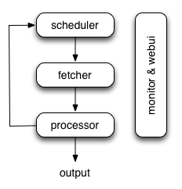

# Python爬虫进阶一之爬虫框架概述

## 综述

爬虫入门之后，我们有两条路可以走。

一个是继续深入学习，以及关于设计模式的一些知识，强化Python相关知识，自己动手造轮子，继续为自己的爬虫增加分布式，多线程等功能扩展。另一条路便是学习一些优秀的框架，先把这些框架用熟，可以确保能够应付一些基本的爬虫任务，也就是所谓的解决温饱问题，然后再深入学习它的源码等知识，进一步强化。

就个人而言，前一种方法其实就是自己动手造轮子，前人其实已经有了一些比较好的框架，可以直接拿来用，但是为了自己能够研究得更加深入和对爬虫有更全面的了解，自己动手去多做。后一种方法就是直接拿来前人已经写好的比较优秀的框架，拿来用好，首先确保可以完成你想要完成的任务，然后自己再深入研究学习。第一种而言，自己探索的多，对爬虫的知识掌握会比较透彻。第二种，拿别人的来用，自己方便了，可是可能就会没有了深入研究框架的心情，还有可能思路被束缚。

不过个人而言，我自己偏向后者。造轮子是不错，但是就算你造轮子，你这不也是在基础类库上造轮子么？能拿来用的就拿来用，学了框架的作用是确保自己可以满足一些爬虫需求，这是最基本的温饱问题。倘若你一直在造轮子，到最后都没造出什么来，别人找你写个爬虫研究了这么长时间了都写不出来，岂不是有点得不偿失？所以，进阶爬虫我还是建议学习一下框架，作为自己的几把武器。至少，我们可以做到了，就像你拿了把枪上战场了，至少，你是可以打击敌人的，比你一直在磨刀好的多吧？

## 框架概述

博主接触了几个爬虫框架，其中比较好用的是 Scrapy 和PySpider。就个人而言，pyspider上手更简单，操作更加简便，因为它增加了 WEB 界面，写爬虫迅速，集成了phantomjs，可以用来抓取js渲染的页面。Scrapy自定义程度高，比 PySpider更底层一些，适合学习研究，需要学习的相关知识多，不过自己拿来研究分布式和多线程等等是非常合适的。

在这里博主会一一把自己的学习经验写出来与大家分享，希望大家可以喜欢，也希望可以给大家一些帮助。

## PySpider

[PySpider](https://github.com/binux/pyspider)是[binux](https://github.com/binux)做的一个爬虫架构的开源化实现。主要的功能需求是：

- 抓取、更新调度多站点的特定的页面
- 需要对页面进行结构化信息提取
- 灵活可扩展，稳定可监控

而这也是绝大多数python爬虫的需求 —— 定向抓取，结构化化解析。但是面对结构迥异的各种网站，单一的抓取模式并不一定能满足，灵活的抓取控制是必须的。为了达到这个目的，单纯的配置文件往往不够灵活，于是，通过脚本去控制抓取是最后的选择。
而去重调度，队列，抓取，异常处理，监控等功能作为框架，提供给抓取脚本，并保证灵活性。最后加上web的编辑调试环境，以及web任务监控，即成为了这套框架。

pyspider的设计基础是：以python脚本驱动的抓取环模型爬虫

- 通过python脚本进行结构化信息的提取，follow链接调度抓取控制，实现最大的灵活性
- 通过web化的脚本编写、调试环境。web展现调度状态
- 抓取环模型成熟稳定，模块间相互独立，通过消息队列连接，从单进程到多机分布式灵活拓展

pyspider的架构主要分为 scheduler（调度器）, fetcher（抓取器）, processor（脚本执行）：

- 各个组件间使用消息队列连接，除了scheduler是单点的，fetcher 和 processor 都是可以多实例分布式部署的。 scheduler 负责整体的调度控制
- 任务由 scheduler 发起调度，fetcher 抓取网页内容， processor 执行预先编写的python脚本，输出结果或产生新的提链任务（发往 scheduler），形成闭环。
- 每个脚本可以灵活使用各种python库对页面进行解析，使用框架API控制下一步抓取动作，通过设置回调控制解析动作。

## Scrapy

> Scrapy是一个为了爬取网站数据，提取结构性数据而编写的应用框架。 可以应用在包括数据挖掘，信息处理或存储历史数据等一系列的程序中。
其最初是为了页面抓取 (更确切来说, 网络抓取 )所设计的， 也可以应用在获取API所返回的数据(例如 Amazon Associates Web Services ) 或者通用的网络爬虫。Scrapy用途广泛，可以用于数据挖掘、监测和自动化测试

Scrapy 使用了 Twisted 异步网络库来处理网络通讯。整体架构大致如下

Scrapy主要包括了以下组件：

- 引擎(Scrapy): 用来处理整个系统的数据流处理, 触发事务(框架核心)
- 调度器(Scheduler): 用来接受引擎发过来的请求, 压入队列中, 并在引擎再次请求的时候返回. 可以想像成一个URL（抓取网页的网址或者说是链接）的优先队列, 由它来决定下一个要抓取的网址是什么, 同时去除重复的网址
- 下载器(Downloader): 用于下载网页内容, 并将网页内容返回给蜘蛛(Scrapy下载器是建立在twisted这个高效的异步模型上的)
- 爬虫(Spiders): 爬虫是主要干活的, 用于从特定的网页中提取自己需要的信息, 即所谓的实体(Item)。用户也可以从中提取出链接,让Scrapy继续抓取下一个页面
- 项目管道(Pipeline): 负责处理爬虫从网页中抽取的实体，主要的功能是持久化实体、验证实体的有效性、清除不需要的信息。当页面被爬虫解析后，将被发送到项目管道，并经过几个特定的次序处理数据。
- 下载器中间件(Downloader Middlewares): 位于Scrapy引擎和下载器之间的框架，主要是处理Scrapy引擎与下载器之间的请求及响应。
- 爬虫中间件(Spider Middlewares): 介于Scrapy引擎和爬虫之间的框架，主要工作是处理蜘蛛的响应输入和请求输出。
- 调度中间件(Scheduler Middewares): 介于Scrapy引擎和调度之间的中间件，从Scrapy引擎发送到调度的请求和响应。

Scrapy运行流程大概如下：

- 首先，引擎从调度器中取出一个链接(URL)用于接下来的抓取
- 引擎把URL封装成一个请求(Request)传给下载器，下载器把资源下载下来，并封装成应答包(Response)
- 然后，爬虫解析Response
- 若是解析出实体（Item）,则交给实体管道进行进一步的处理。
- 若是解析出的是链接（URL）,则把URL交给Scheduler等待抓取

## 结语

对这两个框架进行基本的介绍之后，接下来我会介绍这两个框架的安装以及框架的使用方法，希望对大家有帮助。